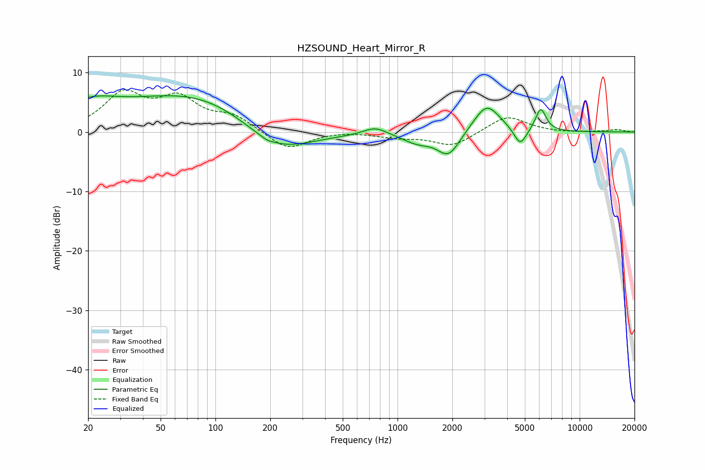

# HZSOUND_Heart_Mirror_R
See [usage instructions](https://github.com/jaakkopasanen/AutoEq#usage) for more options and info.

### Parametric EQs
Apply preamp of -6.2 dB when using parametric equalizer.

|   # | Type    |   Fc (Hz) |    Q |   Gain (dB) |
|-----|---------|-----------|------|-------------|
|   1 | Peaking |        20 | 0.87 |         3.6 |
|   2 | Peaking |        95 | 0.34 |         7.8 |
|   3 | Peaking |       192 | 5.32 |        -0.3 |
|   4 | Peaking |       212 | 0.63 |        -7.3 |
|   5 | Peaking |       753 | 2.24 |         1.3 |
|   6 | Peaking |      1281 | 1.69 |        -1.6 |
|   7 | Peaking |      1909 | 2.27 |        -4   |
|   8 | Peaking |      3091 | 1.94 |         4.9 |
|   9 | Peaking |      4717 | 4.02 |        -3.1 |
|  10 | Peaking |      6109 | 4.78 |         3.9 |

### Fixed Band EQs
When using fixed band (also called graphic) equalizer, apply preamp of **-7.2 dB** (if available) and set gains manually with these parameters.

|   # | Type    |   Fc (Hz) |    Q |   Gain (dB) |
|-----|---------|-----------|------|-------------|
|   1 | Peaking |        31 | 1.41 |         6.1 |
|   2 | Peaking |        62 | 1.41 |         5.1 |
|   3 | Peaking |       125 | 1.41 |         2.4 |
|   4 | Peaking |       250 | 1.41 |        -3.1 |
|   5 | Peaking |       500 | 1.41 |         0.2 |
|   6 | Peaking |      1000 | 1.41 |        -0.8 |
|   7 | Peaking |      2000 | 1.41 |        -2.4 |
|   8 | Peaking |      4000 | 1.41 |         2.8 |
|   9 | Peaking |      8000 | 1.41 |        -0.1 |
|  10 | Peaking |     16000 | 1.41 |         0.4 |

### Graphs

