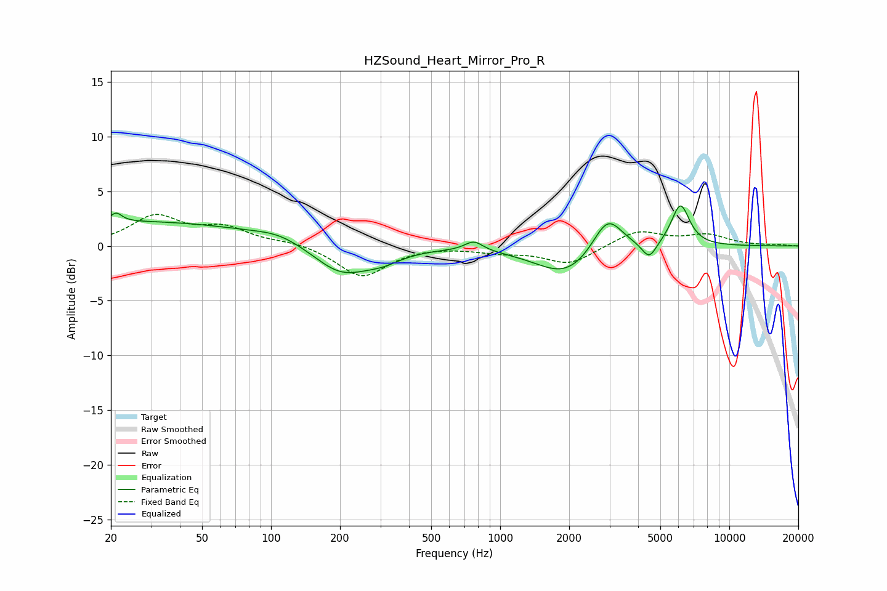

# HZSound_Heart_Mirror_Pro_R
See [usage instructions](https://github.com/jaakkopasanen/AutoEq#usage) for more options and info.

### Parametric EQs
Apply preamp of -3.8 dB when using parametric equalizer.

|   # | Type    |   Fc (Hz) |    Q |   Gain (dB) |
|-----|---------|-----------|------|-------------|
|   1 | Peaking |        21 | 5.94 |         0.8 |
|   2 | Peaking |        25 | 0.24 |         2.2 |
|   3 | Peaking |       109 | 1.37 |         0.6 |
|   4 | Peaking |       202 | 1.16 |        -2.7 |
|   5 | Peaking |       307 | 1.68 |        -0.8 |
|   6 | Peaking |       767 | 3.57 |         0.9 |
|   7 | Peaking |      1950 | 1.05 |        -2.8 |
|   8 | Peaking |      2937 | 2.13 |         3.5 |
|   9 | Peaking |      4472 | 4.35 |        -1.6 |
|  10 | Peaking |      6117 | 3.45 |         3.8 |

### Fixed Band EQs
When using fixed band (also called graphic) equalizer, apply preamp of **-3.0 dB** (if available) and set gains manually with these parameters.

|   # | Type    |   Fc (Hz) |    Q |   Gain (dB) |
|-----|---------|-----------|------|-------------|
|   1 | Peaking |        31 | 1.41 |         2.6 |
|   2 | Peaking |        62 | 1.41 |         1.5 |
|   3 | Peaking |       125 | 1.41 |         0.4 |
|   4 | Peaking |       250 | 1.41 |        -2.8 |
|   5 | Peaking |       500 | 1.41 |         0.1 |
|   6 | Peaking |      1000 | 1.41 |        -0.5 |
|   7 | Peaking |      2000 | 1.41 |        -1.7 |
|   8 | Peaking |      4000 | 1.41 |         1.4 |
|   9 | Peaking |      8000 | 1.41 |         0.9 |
|  10 | Peaking |     16000 | 1.41 |         0.1 |

### Graphs

