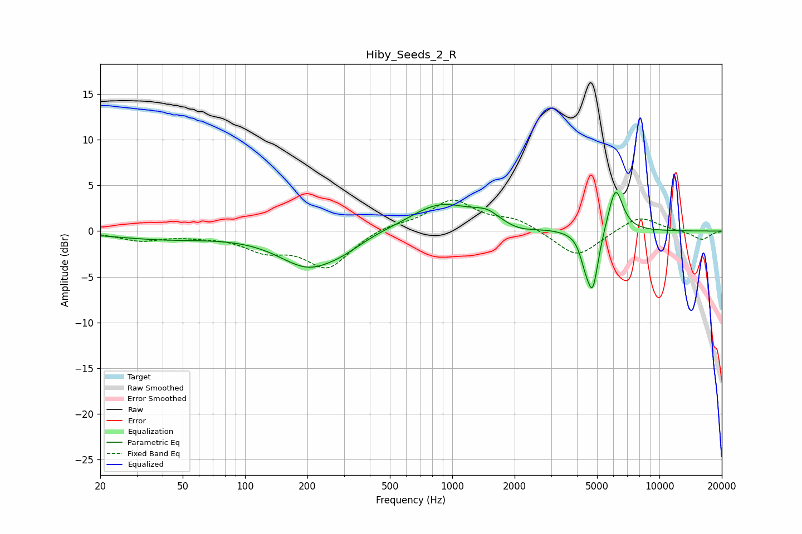

# Hiby_Seeds_2_R
See [usage instructions](https://github.com/jaakkopasanen/AutoEq#usage) for more options and info.

### Parametric EQs
Apply preamp of -4.3 dB when using parametric equalizer.

|   # | Type    |   Fc (Hz) |    Q |   Gain (dB) |
|-----|---------|-----------|------|-------------|
|   1 | Peaking |        40 | 0.56 |        -0.8 |
|   2 | Peaking |       204 | 0.97 |        -3.8 |
|   3 | Peaking |       302 | 1.61 |        -0.7 |
|   4 | Peaking |       879 | 0.93 |         3   |
|   5 | Peaking |      1328 | 2.34 |         0.4 |
|   6 | Peaking |      1501 | 2.7  |         0.8 |
|   7 | Peaking |      2114 | 2.13 |        -0.4 |
|   8 | Peaking |      4362 | 5.96 |        -1.7 |
|   9 | Peaking |      4761 | 4.91 |        -6.4 |
|  10 | Peaking |      6136 | 3.86 |         5   |

### Fixed Band EQs
When using fixed band (also called graphic) equalizer, apply preamp of **-3.5 dB** (if available) and set gains manually with these parameters.

|   # | Type    |   Fc (Hz) |    Q |   Gain (dB) |
|-----|---------|-----------|------|-------------|
|   1 | Peaking |        31 | 1.41 |        -1   |
|   2 | Peaking |        62 | 1.41 |        -0.3 |
|   3 | Peaking |       125 | 1.41 |        -1.8 |
|   4 | Peaking |       250 | 1.41 |        -3.9 |
|   5 | Peaking |       500 | 1.41 |         0.7 |
|   6 | Peaking |      1000 | 1.41 |         3.3 |
|   7 | Peaking |      2000 | 1.41 |         1.2 |
|   8 | Peaking |      4000 | 1.41 |        -3   |
|   9 | Peaking |      8000 | 1.41 |         1.7 |
|  10 | Peaking |     16000 | 1.41 |        -1   |

### Graphs

