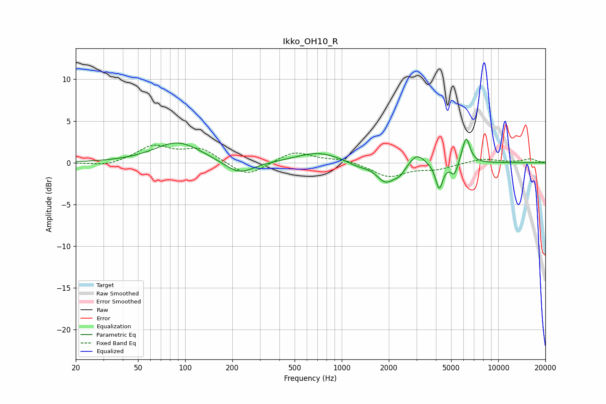

# Ikko_OH10_R
See [usage instructions](https://github.com/jaakkopasanen/AutoEq#usage) for more options and info.

### Parametric EQs
Apply preamp of -3.0 dB when using parametric equalizer.

|   # | Type    |   Fc (Hz) |    Q |   Gain (dB) |
|-----|---------|-----------|------|-------------|
|   1 | Peaking |        90 | 0.95 |         2.5 |
|   2 | Peaking |       221 | 1.5  |        -1.6 |
|   3 | Peaking |       706 | 1.03 |         1.3 |
|   4 | Peaking |      1260 | 2.25 |        -0.5 |
|   5 | Peaking |      1910 | 2.36 |        -2.3 |
|   6 | Peaking |      2347 | 3.96 |        -0.9 |
|   7 | Peaking |      3022 | 3.02 |         1.4 |
|   8 | Peaking |      4195 | 6    |        -3.1 |
|   9 | Peaking |      5239 | 6    |        -1.6 |
|  10 | Peaking |      6227 | 5.49 |         3.2 |

### Fixed Band EQs
When using fixed band (also called graphic) equalizer, apply preamp of **-2.2 dB** (if available) and set gains manually with these parameters.

|   # | Type    |   Fc (Hz) |    Q |   Gain (dB) |
|-----|---------|-----------|------|-------------|
|   1 | Peaking |        31 | 1.41 |        -0.5 |
|   2 | Peaking |        62 | 1.41 |         1.9 |
|   3 | Peaking |       125 | 1.41 |         1.6 |
|   4 | Peaking |       250 | 1.41 |        -1.8 |
|   5 | Peaking |       500 | 1.41 |         1.4 |
|   6 | Peaking |      1000 | 1.41 |         0.4 |
|   7 | Peaking |      2000 | 1.41 |        -1.7 |
|   8 | Peaking |      4000 | 1.41 |        -0.7 |
|   9 | Peaking |      8000 | 1.41 |         0.5 |
|  10 | Peaking |     16000 | 1.41 |         0.5 |

### Graphs

