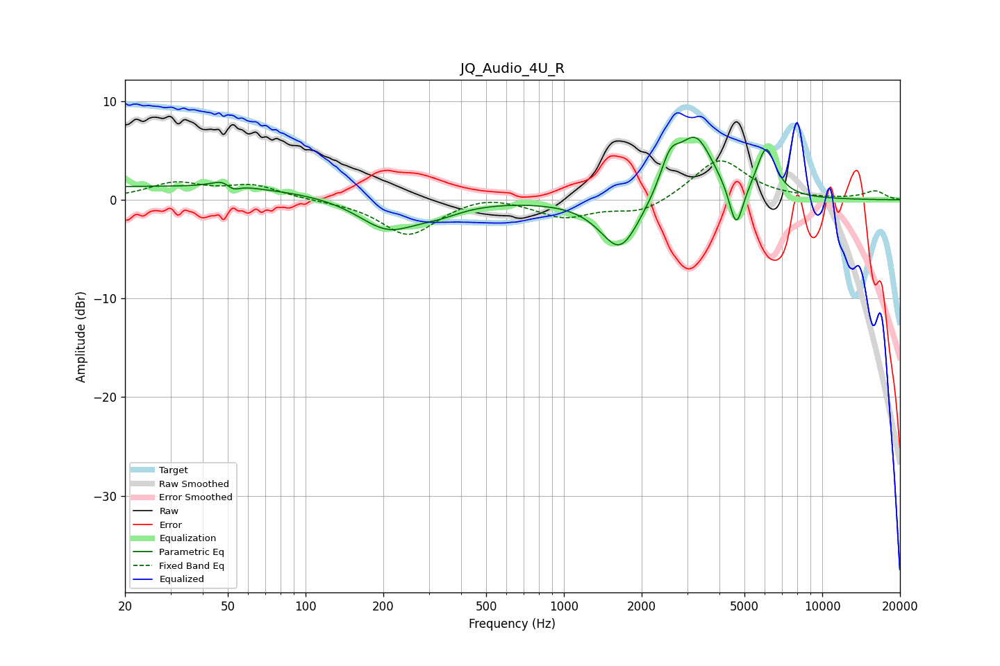

# JQ_Audio_4U_R
See [usage instructions](https://github.com/jaakkopasanen/AutoEq#usage) for more options and info.

### Parametric EQs
Apply preamp of -6.4 dB when using parametric equalizer.

|   # | Type    |   Fc (Hz) |    Q |   Gain (dB) |
|-----|---------|-----------|------|-------------|
|   1 | Peaking |        29 | 0.18 |         1.4 |
|   2 | Peaking |        50 | 3.19 |         1.5 |
|   3 | Peaking |        52 | 4.68 |        -1.4 |
|   4 | Peaking |       208 | 1.22 |        -3.2 |
|   5 | Peaking |       329 | 1.56 |        -0.9 |
|   6 | Peaking |      1650 | 1.85 |        -5.4 |
|   7 | Peaking |      2573 | 3.71 |         3.2 |
|   8 | Peaking |      3233 | 2    |         6.3 |
|   9 | Peaking |      4645 | 5.15 |        -4.7 |
|  10 | Peaking |      6071 | 3.75 |         4.9 |

### Fixed Band EQs
When using fixed band (also called graphic) equalizer, apply preamp of **-4.0 dB** (if available) and set gains manually with these parameters.

|   # | Type    |   Fc (Hz) |    Q |   Gain (dB) |
|-----|---------|-----------|------|-------------|
|   1 | Peaking |        31 | 1.41 |         1.6 |
|   2 | Peaking |        62 | 1.41 |         1.4 |
|   3 | Peaking |       125 | 1.41 |        -0.1 |
|   4 | Peaking |       250 | 1.41 |        -3.6 |
|   5 | Peaking |       500 | 1.41 |         0.7 |
|   6 | Peaking |      1000 | 1.41 |        -1.7 |
|   7 | Peaking |      2000 | 1.41 |        -1.4 |
|   8 | Peaking |      4000 | 1.41 |         4.2 |
|   9 | Peaking |      8000 | 1.41 |         0.1 |
|  10 | Peaking |     16000 | 1.41 |         0.9 |

### Graphs

