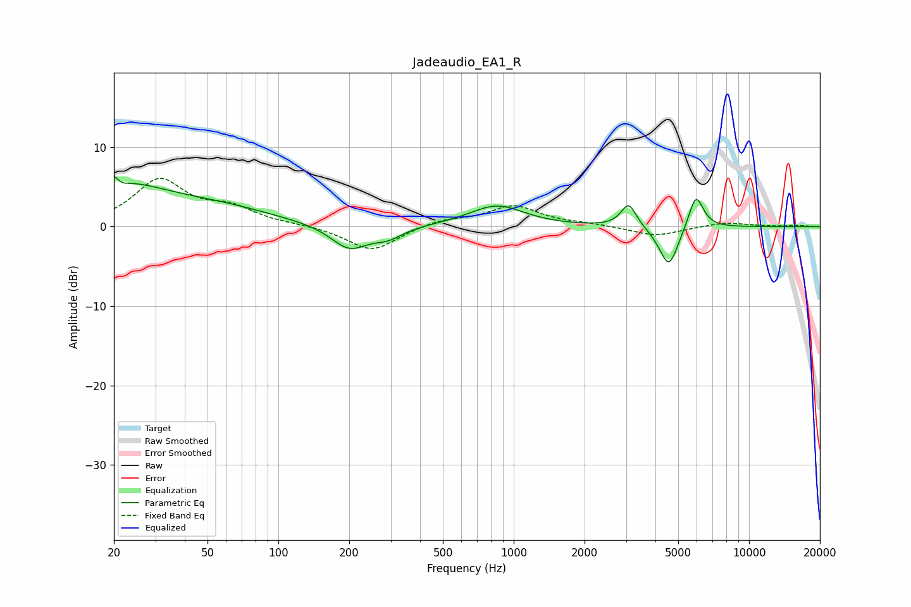

# Jadeaudio_EA1_R
See [usage instructions](https://github.com/jaakkopasanen/AutoEq#usage) for more options and info.

### Parametric EQs
Apply preamp of -6.4 dB when using parametric equalizer.

|   # | Type    |   Fc (Hz) |    Q |   Gain (dB) |
|-----|---------|-----------|------|-------------|
|   1 | Peaking |        20 | 5.99 |         4.5 |
|   2 | Peaking |        20 | 4.65 |        -3.9 |
|   3 | Peaking |        20 | 0.64 |         5.2 |
|   4 | Peaking |        58 | 0.61 |         1.8 |
|   5 | Peaking |       200 | 1.81 |        -3   |
|   6 | Peaking |       292 | 2.23 |        -1.3 |
|   7 | Peaking |       846 | 1.22 |         2.7 |
|   8 | Peaking |      3081 | 4.37 |         3   |
|   9 | Peaking |      4562 | 3.41 |        -5.3 |
|  10 | Peaking |      5944 | 4.37 |         4.4 |

### Fixed Band EQs
When using fixed band (also called graphic) equalizer, apply preamp of **-6.2 dB** (if available) and set gains manually with these parameters.

|   # | Type    |   Fc (Hz) |    Q |   Gain (dB) |
|-----|---------|-----------|------|-------------|
|   1 | Peaking |        31 | 1.41 |         5.7 |
|   2 | Peaking |        62 | 1.41 |         2   |
|   3 | Peaking |       125 | 1.41 |         0.2 |
|   4 | Peaking |       250 | 1.41 |        -3.1 |
|   5 | Peaking |       500 | 1.41 |         0.8 |
|   6 | Peaking |      1000 | 1.41 |         2.6 |
|   7 | Peaking |      2000 | 1.41 |         0.3 |
|   8 | Peaking |      4000 | 1.41 |        -1.2 |
|   9 | Peaking |      8000 | 1.41 |         0.6 |
|  10 | Peaking |     16000 | 1.41 |         0.1 |

### Graphs

