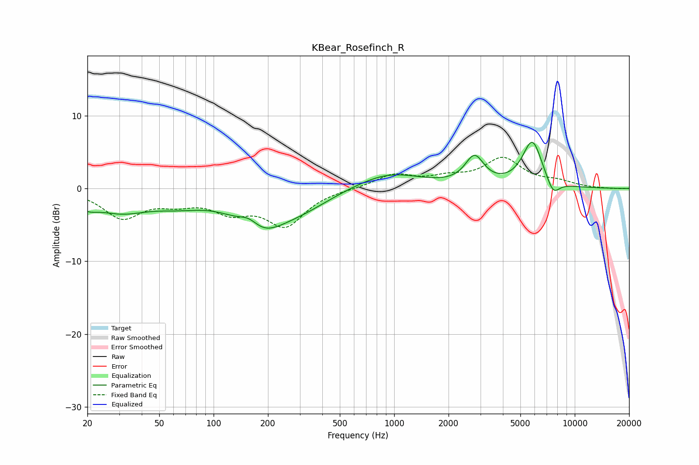

# KBear_Rosefinch_R
See [usage instructions](https://github.com/jaakkopasanen/AutoEq#usage) for more options and info.

### Parametric EQs
Apply preamp of -6.5 dB when using parametric equalizer.

|   # | Type    |   Fc (Hz) |    Q |   Gain (dB) |
|-----|---------|-----------|------|-------------|
|   1 | Peaking |        20 | 2.64 |        -1.1 |
|   2 | Peaking |        30 | 0.87 |        -2.8 |
|   3 | Peaking |        64 | 1    |        -1.3 |
|   4 | Peaking |       157 | 2.42 |         1.7 |
|   5 | Peaking |       178 | 1    |        -5.2 |
|   6 | Peaking |       312 | 0.83 |        -1.9 |
|   7 | Peaking |       927 | 0.77 |         2.2 |
|   8 | Peaking |      2786 | 2.73 |         3.9 |
|   9 | Peaking |      5824 | 2.49 |         6.4 |
|  10 | Peaking |      7587 | 3.71 |        -2.1 |

### Fixed Band EQs
When using fixed band (also called graphic) equalizer, apply preamp of **-4.4 dB** (if available) and set gains manually with these parameters.

|   # | Type    |   Fc (Hz) |    Q |   Gain (dB) |
|-----|---------|-----------|------|-------------|
|   1 | Peaking |        31 | 1.41 |        -3.8 |
|   2 | Peaking |        62 | 1.41 |        -1.5 |
|   3 | Peaking |       125 | 1.41 |        -2.7 |
|   4 | Peaking |       250 | 1.41 |        -4.8 |
|   5 | Peaking |       500 | 1.41 |        -0   |
|   6 | Peaking |      1000 | 1.41 |         1.9 |
|   7 | Peaking |      2000 | 1.41 |         1.2 |
|   8 | Peaking |      4000 | 1.41 |         3.9 |
|   9 | Peaking |      8000 | 1.41 |         0.8 |
|  10 | Peaking |     16000 | 1.41 |        -0   |

### Graphs

