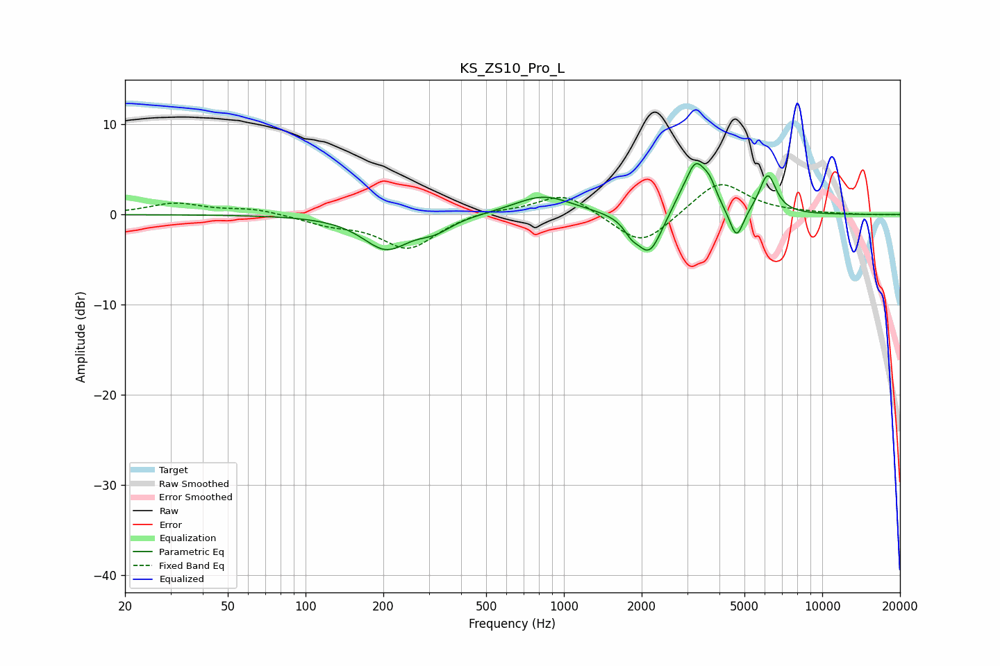

# KS_ZS10_Pro_L
See [usage instructions](https://github.com/jaakkopasanen/AutoEq#usage) for more options and info.

### Parametric EQs
Apply preamp of -5.8 dB when using parametric equalizer.

|   # | Type    |   Fc (Hz) |    Q |   Gain (dB) |
|-----|---------|-----------|------|-------------|
|   1 | Peaking |       205 | 1.56 |        -3.7 |
|   2 | Peaking |       316 | 2.15 |        -1.3 |
|   3 | Peaking |       833 | 1.24 |         2.2 |
|   4 | Peaking |      1822 | 5.18 |        -1.1 |
|   5 | Peaking |      2139 | 2.88 |        -4.6 |
|   6 | Peaking |      2762 | 3.94 |         0.6 |
|   7 | Peaking |      3235 | 3.27 |         5.6 |
|   8 | Peaking |      3676 | 5.54 |         1.6 |
|   9 | Peaking |      4659 | 5.26 |        -3.5 |
|  10 | Peaking |      6152 | 4.28 |         4.4 |

### Fixed Band EQs
When using fixed band (also called graphic) equalizer, apply preamp of **-3.4 dB** (if available) and set gains manually with these parameters.

|   # | Type    |   Fc (Hz) |    Q |   Gain (dB) |
|-----|---------|-----------|------|-------------|
|   1 | Peaking |        31 | 1.41 |         1.2 |
|   2 | Peaking |        62 | 1.41 |         0.6 |
|   3 | Peaking |       125 | 1.41 |        -0.9 |
|   4 | Peaking |       250 | 1.41 |        -3.7 |
|   5 | Peaking |       500 | 1.41 |         0.5 |
|   6 | Peaking |      1000 | 1.41 |         2.5 |
|   7 | Peaking |      2000 | 1.41 |        -3.7 |
|   8 | Peaking |      4000 | 1.41 |         3.8 |
|   9 | Peaking |      8000 | 1.41 |         0.1 |
|  10 | Peaking |     16000 | 1.41 |        -0   |

### Graphs

