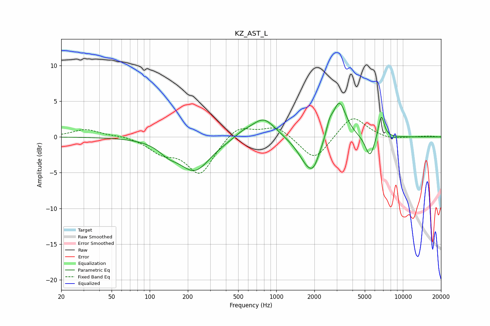

# KZ_AST_L
See [usage instructions](https://github.com/jaakkopasanen/AutoEq#usage) for more options and info.

### Parametric EQs
Apply preamp of -4.8 dB when using parametric equalizer.

|   # | Type    |   Fc (Hz) |    Q |   Gain (dB) |
|-----|---------|-----------|------|-------------|
|   1 | Peaking |       140 | 1.91 |        -1.2 |
|   2 | Peaking |       227 | 1.16 |        -4.6 |
|   3 | Peaking |       540 | 2.12 |         0.6 |
|   4 | Peaking |       793 | 1.49 |         2.9 |
|   5 | Peaking |      1836 | 1.74 |        -4.6 |
|   6 | Peaking |      1985 | 3.98 |        -0.9 |
|   7 | Peaking |      2630 | 5.43 |         1.5 |
|   8 | Peaking |      3142 | 2.6  |         5.4 |
|   9 | Peaking |      5496 | 3.84 |        -3.1 |
|  10 | Peaking |      6747 | 5.77 |         3.4 |

### Fixed Band EQs
When using fixed band (also called graphic) equalizer, apply preamp of **-2.6 dB** (if available) and set gains manually with these parameters.

|   # | Type    |   Fc (Hz) |    Q |   Gain (dB) |
|-----|---------|-----------|------|-------------|
|   1 | Peaking |        31 | 1.41 |         1.1 |
|   2 | Peaking |        62 | 1.41 |         0.2 |
|   3 | Peaking |       125 | 1.41 |        -1.9 |
|   4 | Peaking |       250 | 1.41 |        -5.1 |
|   5 | Peaking |       500 | 1.41 |         1.8 |
|   6 | Peaking |      1000 | 1.41 |         1.6 |
|   7 | Peaking |      2000 | 1.41 |        -3.4 |
|   8 | Peaking |      4000 | 1.41 |         3.1 |
|   9 | Peaking |      8000 | 1.41 |        -0.4 |
|  10 | Peaking |     16000 | 1.41 |         0.1 |

### Graphs

