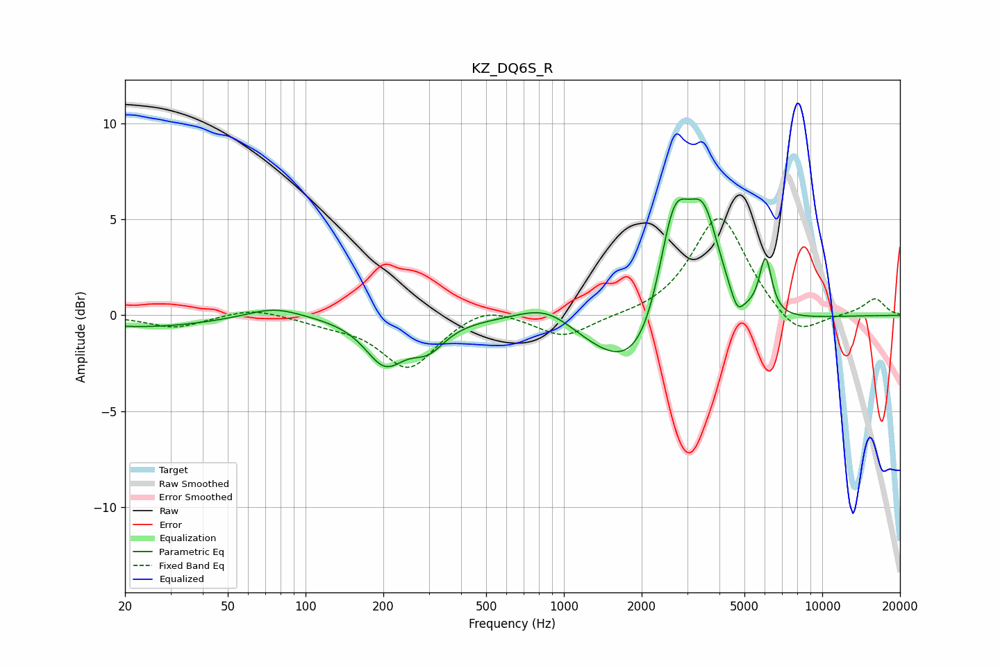

# KZ_DQ6S_R
See [usage instructions](https://github.com/jaakkopasanen/AutoEq#usage) for more options and info.

### Parametric EQs
Apply preamp of -6.2 dB when using parametric equalizer.

|   # | Type    |   Fc (Hz) |    Q |   Gain (dB) |
|-----|---------|-----------|------|-------------|
|   1 | Peaking |        24 | 0.53 |        -0.6 |
|   2 | Peaking |        75 | 1.33 |         0.6 |
|   3 | Peaking |       203 | 1.85 |        -2.3 |
|   4 | Peaking |       298 | 2.11 |        -1.3 |
|   5 | Peaking |       862 | 1.23 |         1.2 |
|   6 | Peaking |      2274 | 0.74 |        -5.6 |
|   7 | Peaking |      2661 | 1.95 |         8.2 |
|   8 | Peaking |      3481 | 2.06 |         5.8 |
|   9 | Peaking |      4688 | 5.78 |        -1   |
|  10 | Peaking |      6031 | 5.8  |         3   |

### Fixed Band EQs
When using fixed band (also called graphic) equalizer, apply preamp of **-5.1 dB** (if available) and set gains manually with these parameters.

|   # | Type    |   Fc (Hz) |    Q |   Gain (dB) |
|-----|---------|-----------|------|-------------|
|   1 | Peaking |        31 | 1.41 |        -0.6 |
|   2 | Peaking |        62 | 1.41 |         0.4 |
|   3 | Peaking |       125 | 1.41 |        -0.3 |
|   4 | Peaking |       250 | 1.41 |        -2.8 |
|   5 | Peaking |       500 | 1.41 |         0.7 |
|   6 | Peaking |      1000 | 1.41 |        -1.2 |
|   7 | Peaking |      2000 | 1.41 |        -0.1 |
|   8 | Peaking |      4000 | 1.41 |         5.3 |
|   9 | Peaking |      8000 | 1.41 |        -1.3 |
|  10 | Peaking |     16000 | 1.41 |         0.9 |

### Graphs

