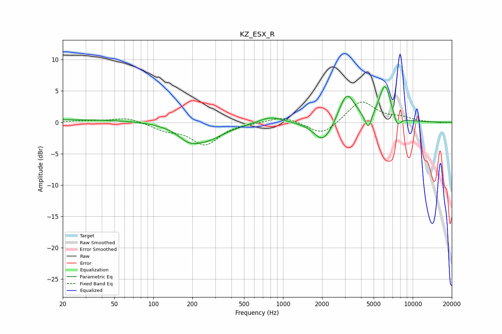

# KZ_ESX_R
See [usage instructions](https://github.com/jaakkopasanen/AutoEq#usage) for more options and info.

### Parametric EQs
Apply preamp of -5.8 dB when using parametric equalizer.

|   # | Type    |   Fc (Hz) |    Q |   Gain (dB) |
|-----|---------|-----------|------|-------------|
|   1 | Peaking |        32 | 0.19 |         0.4 |
|   2 | Peaking |       183 | 2.17 |        -1   |
|   3 | Peaking |       239 | 0.93 |        -3   |
|   4 | Peaking |       806 | 1.46 |         1.1 |
|   5 | Peaking |      2033 | 2.01 |        -3.4 |
|   6 | Peaking |      2418 | 5.4  |        -0.2 |
|   7 | Peaking |      3105 | 2.31 |         4.8 |
|   8 | Peaking |      4541 | 5.52 |        -2.6 |
|   9 | Peaking |      6114 | 2.94 |         5.9 |
|  10 | Peaking |      7569 | 4.58 |        -2   |

### Fixed Band EQs
When using fixed band (also called graphic) equalizer, apply preamp of **-3.3 dB** (if available) and set gains manually with these parameters.

|   # | Type    |   Fc (Hz) |    Q |   Gain (dB) |
|-----|---------|-----------|------|-------------|
|   1 | Peaking |        31 | 1.41 |         0.2 |
|   2 | Peaking |        62 | 1.41 |         0.8 |
|   3 | Peaking |       125 | 1.41 |        -1.1 |
|   4 | Peaking |       250 | 1.41 |        -3.5 |
|   5 | Peaking |       500 | 1.41 |        -0   |
|   6 | Peaking |      1000 | 1.41 |         1   |
|   7 | Peaking |      2000 | 1.41 |        -2.2 |
|   8 | Peaking |      4000 | 1.41 |         3.5 |
|   9 | Peaking |      8000 | 1.41 |         0.6 |
|  10 | Peaking |     16000 | 1.41 |        -0.1 |

### Graphs

