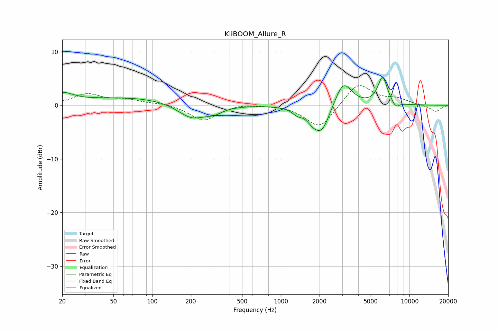

# KiiBOOM_Allure_R
See [usage instructions](https://github.com/jaakkopasanen/AutoEq#usage) for more options and info.

### Parametric EQs
Apply preamp of -5.3 dB when using parametric equalizer.

|   # | Type    |   Fc (Hz) |    Q |   Gain (dB) |
|-----|---------|-----------|------|-------------|
|   1 | Peaking |        20 | 1.7  |         1.8 |
|   2 | Peaking |        71 | 0.35 |         1.5 |
|   3 | Peaking |       203 | 1.29 |        -2.9 |
|   4 | Peaking |       303 | 2.05 |        -1   |
|   5 | Peaking |      1347 | 3.5  |        -1.1 |
|   6 | Peaking |      1755 | 3.22 |        -1.4 |
|   7 | Peaking |      2082 | 2.25 |        -5   |
|   8 | Peaking |      3057 | 2.2  |         4.8 |
|   9 | Peaking |      6182 | 3.74 |         5.1 |
|  10 | Peaking |      7822 | 4.66 |        -1.1 |

### Fixed Band EQs
When using fixed band (also called graphic) equalizer, apply preamp of **-3.8 dB** (if available) and set gains manually with these parameters.

|   # | Type    |   Fc (Hz) |    Q |   Gain (dB) |
|-----|---------|-----------|------|-------------|
|   1 | Peaking |        31 | 1.41 |         2   |
|   2 | Peaking |        62 | 1.41 |         0.9 |
|   3 | Peaking |       125 | 1.41 |         0.4 |
|   4 | Peaking |       250 | 1.41 |        -2.9 |
|   5 | Peaking |       500 | 1.41 |         0.4 |
|   6 | Peaking |      1000 | 1.41 |         0.1 |
|   7 | Peaking |      2000 | 1.41 |        -4.4 |
|   8 | Peaking |      4000 | 1.41 |         4.3 |
|   9 | Peaking |      8000 | 1.41 |         1.1 |
|  10 | Peaking |     16000 | 1.41 |        -1.2 |

### Graphs

