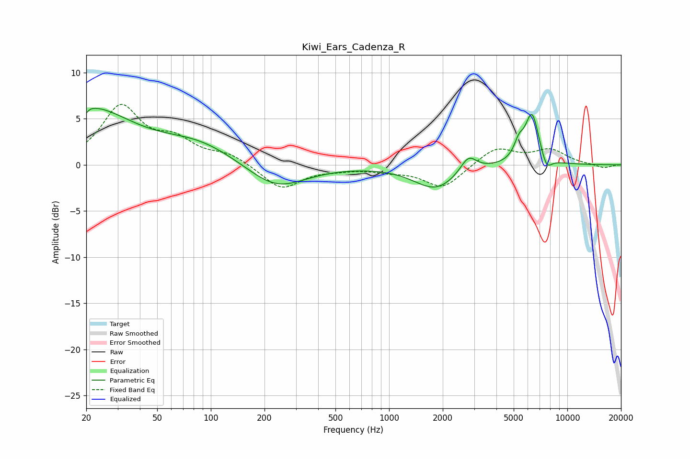

# Kiwi_Ears_Cadenza_R
See [usage instructions](https://github.com/jaakkopasanen/AutoEq#usage) for more options and info.

### Parametric EQs
Apply preamp of -6.2 dB when using parametric equalizer.

|   # | Type    |   Fc (Hz) |    Q |   Gain (dB) |
|-----|---------|-----------|------|-------------|
|   1 | Peaking |        20 | 0.57 |         6.1 |
|   2 | Peaking |        20 | 5.92 |        -3.9 |
|   3 | Peaking |        20 | 5.98 |         3.2 |
|   4 | Peaking |        85 | 0.66 |         2.1 |
|   5 | Peaking |       232 | 0.86 |        -2.8 |
|   6 | Peaking |      1826 | 1.16 |        -2.6 |
|   7 | Peaking |      2787 | 3.11 |         1.8 |
|   8 | Peaking |      5350 | 5.08 |         1.6 |
|   9 | Peaking |      6336 | 3.45 |         5.5 |
|  10 | Peaking |      7642 | 4.56 |        -1.5 |

### Fixed Band EQs
When using fixed band (also called graphic) equalizer, apply preamp of **-6.6 dB** (if available) and set gains manually with these parameters.

|   # | Type    |   Fc (Hz) |    Q |   Gain (dB) |
|-----|---------|-----------|------|-------------|
|   1 | Peaking |        31 | 1.41 |         6.1 |
|   2 | Peaking |        62 | 1.41 |         2.2 |
|   3 | Peaking |       125 | 1.41 |         1.1 |
|   4 | Peaking |       250 | 1.41 |        -2.6 |
|   5 | Peaking |       500 | 1.41 |        -0.3 |
|   6 | Peaking |      1000 | 1.41 |        -0.5 |
|   7 | Peaking |      2000 | 1.41 |        -2.5 |
|   8 | Peaking |      4000 | 1.41 |         1.9 |
|   9 | Peaking |      8000 | 1.41 |         1.6 |
|  10 | Peaking |     16000 | 1.41 |        -0.4 |

### Graphs

