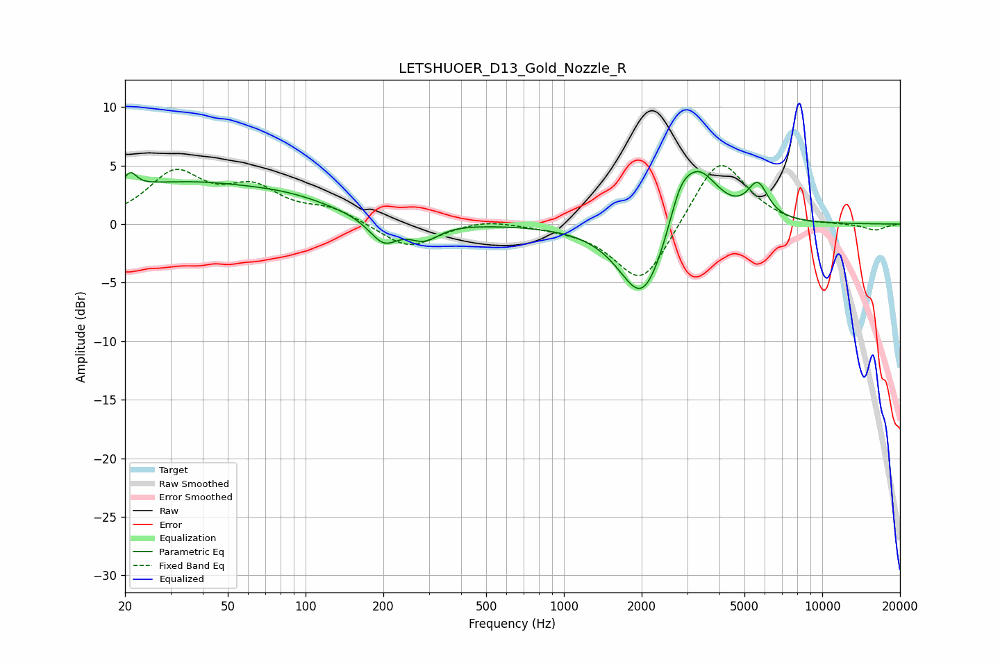

# LETSHUOER_D13_Gold_Nozzle_R
See [usage instructions](https://github.com/jaakkopasanen/AutoEq#usage) for more options and info.

### Parametric EQs
Apply preamp of -4.6 dB when using parametric equalizer.

|   # | Type    |   Fc (Hz) |    Q |   Gain (dB) |
|-----|---------|-----------|------|-------------|
|   1 | Peaking |        21 | 5.93 |         1.3 |
|   2 | Peaking |        32 | 0.39 |         3.4 |
|   3 | Peaking |        90 | 0.78 |         1   |
|   4 | Peaking |       200 | 2.55 |        -2.1 |
|   5 | Peaking |       288 | 2.48 |        -1.4 |
|   6 | Peaking |      2014 | 1.57 |        -6.9 |
|   7 | Peaking |      2486 | 1.81 |        -0.4 |
|   8 | Peaking |      2809 | 3.12 |         2.6 |
|   9 | Peaking |      3311 | 1.72 |         5.2 |
|  10 | Peaking |      5633 | 3.46 |         2.9 |

### Fixed Band EQs
When using fixed band (also called graphic) equalizer, apply preamp of **-5.1 dB** (if available) and set gains manually with these parameters.

|   # | Type    |   Fc (Hz) |    Q |   Gain (dB) |
|-----|---------|-----------|------|-------------|
|   1 | Peaking |        31 | 1.41 |         4.1 |
|   2 | Peaking |        62 | 1.41 |         2.7 |
|   3 | Peaking |       125 | 1.41 |         1.2 |
|   4 | Peaking |       250 | 1.41 |        -2.1 |
|   5 | Peaking |       500 | 1.41 |         0.5 |
|   6 | Peaking |      1000 | 1.41 |        -0.2 |
|   7 | Peaking |      2000 | 1.41 |        -5.4 |
|   8 | Peaking |      4000 | 1.41 |         6   |
|   9 | Peaking |      8000 | 1.41 |        -0.2 |
|  10 | Peaking |     16000 | 1.41 |        -0.5 |

### Graphs

