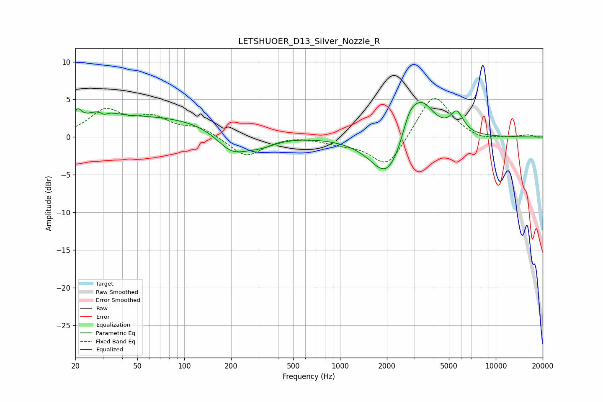

# LETSHUOER_D13_Silver_Nozzle_R
See [usage instructions](https://github.com/jaakkopasanen/AutoEq#usage) for more options and info.

### Parametric EQs
Apply preamp of -4.7 dB when using parametric equalizer.

|   # | Type    |   Fc (Hz) |    Q |   Gain (dB) |
|-----|---------|-----------|------|-------------|
|   1 | Peaking |        21 | 5.98 |         1.4 |
|   2 | Peaking |        29 | 1.92 |         1.2 |
|   3 | Peaking |        31 | 5.92 |        -0.6 |
|   4 | Peaking |        61 | 0.25 |         2.8 |
|   5 | Peaking |       202 | 1.38 |        -2.9 |
|   6 | Peaking |       306 | 1.3  |        -1.4 |
|   7 | Peaking |      2017 | 1.31 |        -5.9 |
|   8 | Peaking |      2782 | 3.13 |         2.4 |
|   9 | Peaking |      3316 | 1.63 |         5.4 |
|  10 | Peaking |      5628 | 3.33 |         2.7 |

### Fixed Band EQs
When using fixed band (also called graphic) equalizer, apply preamp of **-5.3 dB** (if available) and set gains manually with these parameters.

|   # | Type    |   Fc (Hz) |    Q |   Gain (dB) |
|-----|---------|-----------|------|-------------|
|   1 | Peaking |        31 | 1.41 |         3.4 |
|   2 | Peaking |        62 | 1.41 |         2.3 |
|   3 | Peaking |       125 | 1.41 |         1.2 |
|   4 | Peaking |       250 | 1.41 |        -2.7 |
|   5 | Peaking |       500 | 1.41 |         0.3 |
|   6 | Peaking |      1000 | 1.41 |        -0.7 |
|   7 | Peaking |      2000 | 1.41 |        -4.2 |
|   8 | Peaking |      4000 | 1.41 |         6   |
|   9 | Peaking |      8000 | 1.41 |        -0.6 |
|  10 | Peaking |     16000 | 1.41 |         0.3 |

### Graphs

