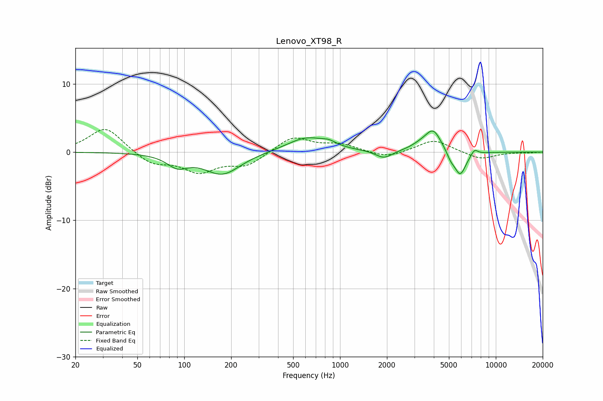

# Lenovo_XT98_R
See [usage instructions](https://github.com/jaakkopasanen/AutoEq#usage) for more options and info.

### Parametric EQs
Apply preamp of -3.2 dB when using parametric equalizer.

|   # | Type    |   Fc (Hz) |    Q |   Gain (dB) |
|-----|---------|-----------|------|-------------|
|   1 | Peaking |        90 | 2.17 |        -1.7 |
|   2 | Peaking |       175 | 1.21 |        -3.2 |
|   3 | Peaking |       612 | 1.1  |         2.2 |
|   4 | Peaking |       850 | 3.18 |         0.5 |
|   5 | Peaking |      1914 | 2.67 |        -1.2 |
|   6 | Peaking |      3305 | 2.07 |         0.8 |
|   7 | Peaking |      3971 | 2.76 |         3   |
|   8 | Peaking |      5125 | 6    |        -0.8 |
|   9 | Peaking |      5898 | 3.54 |        -3.6 |
|  10 | Peaking |      7292 | 5.99 |         0.9 |

### Fixed Band EQs
When using fixed band (also called graphic) equalizer, apply preamp of **-3.4 dB** (if available) and set gains manually with these parameters.

|   # | Type    |   Fc (Hz) |    Q |   Gain (dB) |
|-----|---------|-----------|------|-------------|
|   1 | Peaking |        31 | 1.41 |         3.7 |
|   2 | Peaking |        62 | 1.41 |        -1.8 |
|   3 | Peaking |       125 | 1.41 |        -2.7 |
|   4 | Peaking |       250 | 1.41 |        -1.9 |
|   5 | Peaking |       500 | 1.41 |         2.3 |
|   6 | Peaking |      1000 | 1.41 |         1.1 |
|   7 | Peaking |      2000 | 1.41 |        -0.9 |
|   8 | Peaking |      4000 | 1.41 |         1.8 |
|   9 | Peaking |      8000 | 1.41 |        -1.1 |
|  10 | Peaking |     16000 | 1.41 |        -0.1 |

### Graphs

