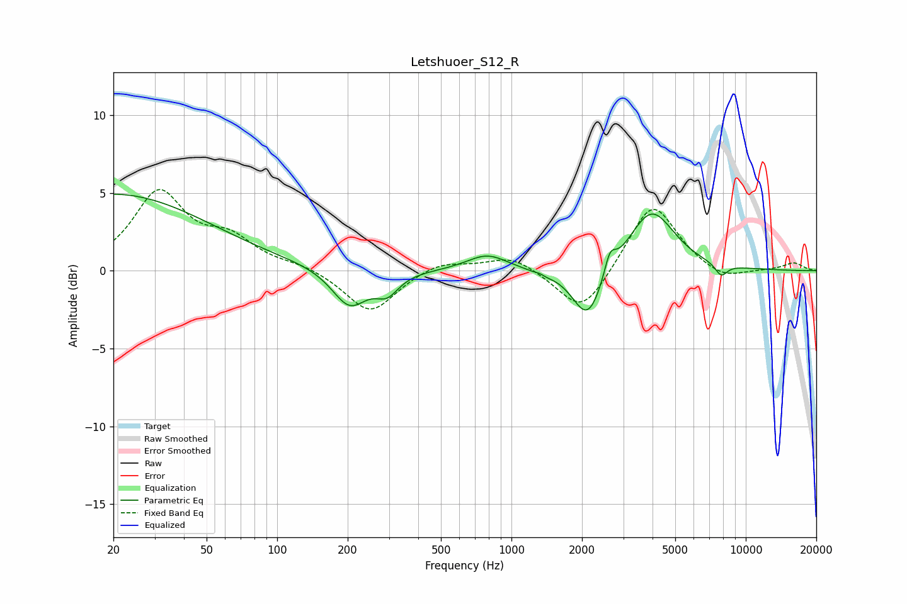

# Letshuoer_S12_R
See [usage instructions](https://github.com/jaakkopasanen/AutoEq#usage) for more options and info.

### Parametric EQs
Apply preamp of -5.0 dB when using parametric equalizer.

|   # | Type    |   Fc (Hz) |    Q |   Gain (dB) |
|-----|---------|-----------|------|-------------|
|   1 | Peaking |        20 | 0.35 |         4.9 |
|   2 | Peaking |       203 | 1.91 |        -2.4 |
|   3 | Peaking |       295 | 2.84 |        -1.2 |
|   4 | Peaking |       788 | 1.63 |         1.1 |
|   5 | Peaking |      1320 | 5.99 |         0.4 |
|   6 | Peaking |      1329 | 4.5  |        -0.4 |
|   7 | Peaking |      2121 | 2.15 |        -3.5 |
|   8 | Peaking |      2632 | 5.93 |         1.4 |
|   9 | Peaking |      3957 | 1.44 |         4   |
|  10 | Peaking |      7855 | 5.03 |        -0.8 |

### Fixed Band EQs
When using fixed band (also called graphic) equalizer, apply preamp of **-5.3 dB** (if available) and set gains manually with these parameters.

|   # | Type    |   Fc (Hz) |    Q |   Gain (dB) |
|-----|---------|-----------|------|-------------|
|   1 | Peaking |        31 | 1.41 |         4.9 |
|   2 | Peaking |        62 | 1.41 |         1.8 |
|   3 | Peaking |       125 | 1.41 |         0.3 |
|   4 | Peaking |       250 | 1.41 |        -2.8 |
|   5 | Peaking |       500 | 1.41 |         0.7 |
|   6 | Peaking |      1000 | 1.41 |         1   |
|   7 | Peaking |      2000 | 1.41 |        -2.9 |
|   8 | Peaking |      4000 | 1.41 |         4.5 |
|   9 | Peaking |      8000 | 1.41 |        -0.7 |
|  10 | Peaking |     16000 | 1.41 |         0.5 |

### Graphs

