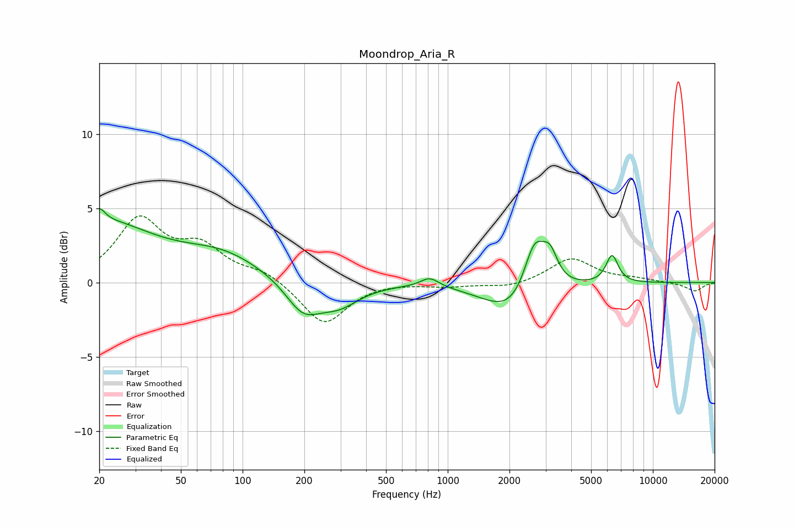

# Moondrop_Aria_R
See [usage instructions](https://github.com/jaakkopasanen/AutoEq#usage) for more options and info.

### Parametric EQs
Apply preamp of -5.1 dB when using parametric equalizer.

|   # | Type    |   Fc (Hz) |    Q |   Gain (dB) |
|-----|---------|-----------|------|-------------|
|   1 | Peaking |        20 | 0.54 |         3.9 |
|   2 | Peaking |        20 | 5.52 |         0.8 |
|   3 | Peaking |        80 | 0.71 |         1.6 |
|   4 | Peaking |       197 | 1.67 |        -2.1 |
|   5 | Peaking |       293 | 1.38 |        -1.4 |
|   6 | Peaking |       817 | 3.09 |         0.7 |
|   7 | Peaking |      2083 | 1.05 |        -2.2 |
|   8 | Peaking |      2650 | 2.62 |         3.7 |
|   9 | Peaking |      3156 | 3.82 |         1.8 |
|  10 | Peaking |      6325 | 4.64 |         1.9 |

### Fixed Band EQs
When using fixed band (also called graphic) equalizer, apply preamp of **-4.6 dB** (if available) and set gains manually with these parameters.

|   # | Type    |   Fc (Hz) |    Q |   Gain (dB) |
|-----|---------|-----------|------|-------------|
|   1 | Peaking |        31 | 1.41 |         4.1 |
|   2 | Peaking |        62 | 1.41 |         2.1 |
|   3 | Peaking |       125 | 1.41 |         0.7 |
|   4 | Peaking |       250 | 1.41 |        -2.9 |
|   5 | Peaking |       500 | 1.41 |         0.1 |
|   6 | Peaking |      1000 | 1.41 |        -0.2 |
|   7 | Peaking |      2000 | 1.41 |        -0.4 |
|   8 | Peaking |      4000 | 1.41 |         1.6 |
|   9 | Peaking |      8000 | 1.41 |         0.2 |
|  10 | Peaking |     16000 | 1.41 |        -0.6 |

### Graphs

