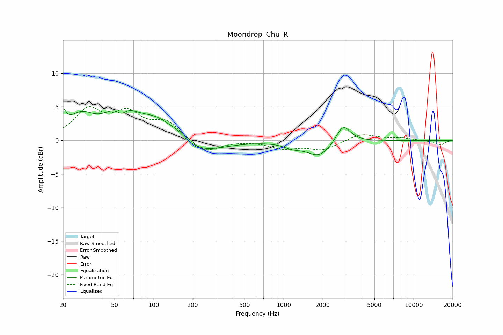

# Moondrop_Chu_R
See [usage instructions](https://github.com/jaakkopasanen/AutoEq#usage) for more options and info.

### Parametric EQs
Apply preamp of -4.8 dB when using parametric equalizer.

|   # | Type    |   Fc (Hz) |    Q |   Gain (dB) |
|-----|---------|-----------|------|-------------|
|   1 | Peaking |        20 | 6    |         2.5 |
|   2 | Peaking |        27 | 1.4  |         3.1 |
|   3 | Peaking |        56 | 1.27 |         4.4 |
|   4 | Peaking |        56 | 3.45 |        -1.7 |
|   5 | Peaking |       107 | 1.09 |         2.9 |
|   6 | Peaking |       153 | 2.46 |         0.8 |
|   7 | Peaking |       222 | 0.79 |        -2   |
|   8 | Peaking |      1175 | 2.1  |        -0.7 |
|   9 | Peaking |      1887 | 1.49 |        -2.4 |
|  10 | Peaking |      2871 | 2.56 |         2.8 |

### Fixed Band EQs
When using fixed band (also called graphic) equalizer, apply preamp of **-5.1 dB** (if available) and set gains manually with these parameters.

|   # | Type    |   Fc (Hz) |    Q |   Gain (dB) |
|-----|---------|-----------|------|-------------|
|   1 | Peaking |        31 | 1.41 |         4.2 |
|   2 | Peaking |        62 | 1.41 |         3.6 |
|   3 | Peaking |       125 | 1.41 |         2.6 |
|   4 | Peaking |       250 | 1.41 |        -1.9 |
|   5 | Peaking |       500 | 1.41 |         0   |
|   6 | Peaking |      1000 | 1.41 |        -1.1 |
|   7 | Peaking |      2000 | 1.41 |        -1.4 |
|   8 | Peaking |      4000 | 1.41 |         1   |
|   9 | Peaking |      8000 | 1.41 |         0.3 |
|  10 | Peaking |     16000 | 1.41 |        -0.7 |

### Graphs

