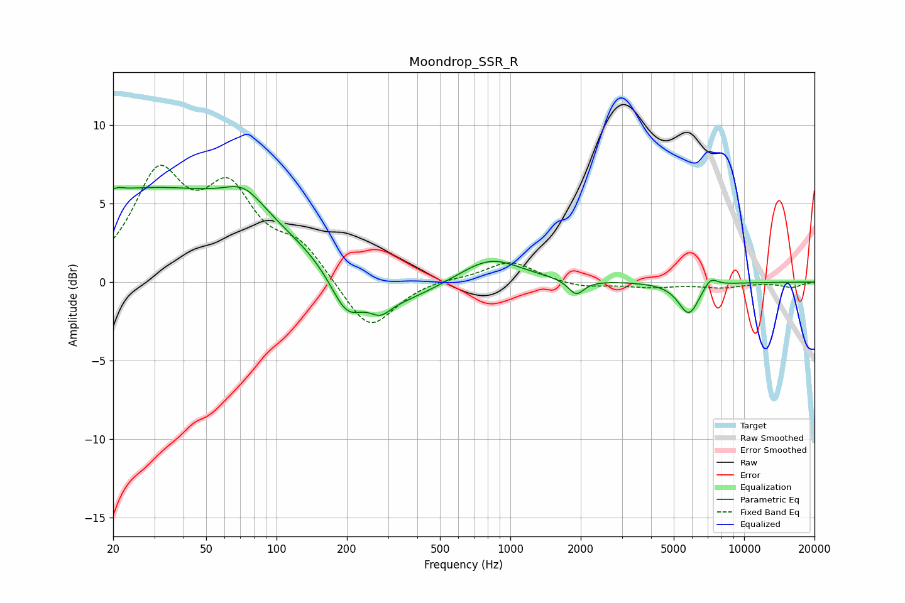

# Moondrop_SSR_R
See [usage instructions](https://github.com/jaakkopasanen/AutoEq#usage) for more options and info.

### Parametric EQs
Apply preamp of -6.2 dB when using parametric equalizer.

|   # | Type    |   Fc (Hz) |    Q |   Gain (dB) |
|-----|---------|-----------|------|-------------|
|   1 | Peaking |        21 | 5.94 |         0.2 |
|   2 | Peaking |        29 | 0.23 |         5.9 |
|   3 | Peaking |        73 | 1.68 |         1.4 |
|   4 | Peaking |       199 | 2.02 |        -2.5 |
|   5 | Peaking |       278 | 3.13 |        -0.9 |
|   6 | Peaking |       318 | 0.83 |        -1.7 |
|   7 | Peaking |       822 | 1.08 |         1.6 |
|   8 | Peaking |      1913 | 4.26 |        -1   |
|   9 | Peaking |      5804 | 3.07 |        -2.1 |
|  10 | Peaking |      7176 | 4.41 |         0.7 |

### Fixed Band EQs
When using fixed band (also called graphic) equalizer, apply preamp of **-7.5 dB** (if available) and set gains manually with these parameters.

|   # | Type    |   Fc (Hz) |    Q |   Gain (dB) |
|-----|---------|-----------|------|-------------|
|   1 | Peaking |        31 | 1.41 |         6.4 |
|   2 | Peaking |        62 | 1.41 |         5.1 |
|   3 | Peaking |       125 | 1.41 |         2.1 |
|   4 | Peaking |       250 | 1.41 |        -3.3 |
|   5 | Peaking |       500 | 1.41 |         0.2 |
|   6 | Peaking |      1000 | 1.41 |         1.4 |
|   7 | Peaking |      2000 | 1.41 |        -0.4 |
|   8 | Peaking |      4000 | 1.41 |        -0.3 |
|   9 | Peaking |      8000 | 1.41 |        -0.3 |
|  10 | Peaking |     16000 | 1.41 |        -0.3 |

### Graphs

