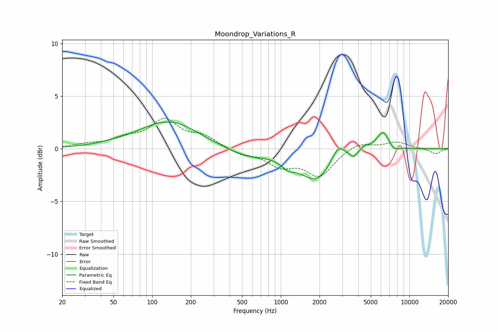

# Moondrop_Variations_R
See [usage instructions](https://github.com/jaakkopasanen/AutoEq#usage) for more options and info.

### Parametric EQs
Apply preamp of -2.6 dB when using parametric equalizer.

|   # | Type    |   Fc (Hz) |    Q |   Gain (dB) |
|-----|---------|-----------|------|-------------|
|   1 | Peaking |        48 | 1.26 |         0.1 |
|   2 | Peaking |       135 | 0.62 |         2.6 |
|   3 | Peaking |       536 | 0.78 |        -0.8 |
|   4 | Peaking |      1141 | 2.89 |        -0.7 |
|   5 | Peaking |      1889 | 1.08 |        -3   |
|   6 | Peaking |      2784 | 2.69 |         1.6 |
|   7 | Peaking |      3676 | 5.34 |        -0.5 |
|   8 | Peaking |      4503 | 4.31 |         0.4 |
|   9 | Peaking |      6202 | 2.74 |         1.8 |
|  10 | Peaking |      7607 | 4.35 |        -0.5 |

### Fixed Band EQs
When using fixed band (also called graphic) equalizer, apply preamp of **-3.0 dB** (if available) and set gains manually with these parameters.

|   # | Type    |   Fc (Hz) |    Q |   Gain (dB) |
|-----|---------|-----------|------|-------------|
|   1 | Peaking |        31 | 1.41 |         0.3 |
|   2 | Peaking |        62 | 1.41 |         0.8 |
|   3 | Peaking |       125 | 1.41 |         2.6 |
|   4 | Peaking |       250 | 1.41 |         1   |
|   5 | Peaking |       500 | 1.41 |        -0.5 |
|   6 | Peaking |      1000 | 1.41 |        -1.5 |
|   7 | Peaking |      2000 | 1.41 |        -2.5 |
|   8 | Peaking |      4000 | 1.41 |         0.7 |
|   9 | Peaking |      8000 | 1.41 |         0.6 |
|  10 | Peaking |     16000 | 1.41 |        -0.5 |

### Graphs

