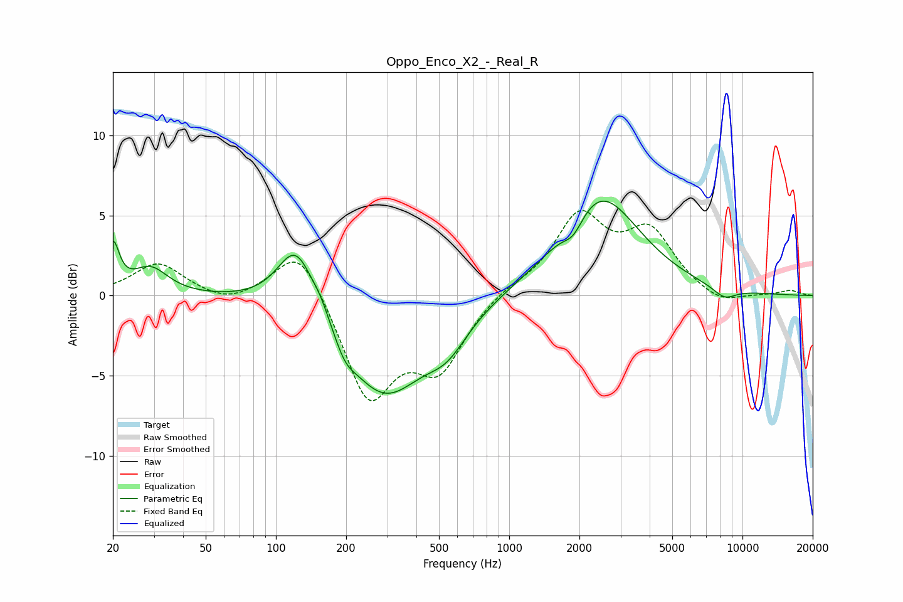

# Oppo_Enco_X2_-_Real_R
See [usage instructions](https://github.com/jaakkopasanen/AutoEq#usage) for more options and info.

### Parametric EQs
Apply preamp of -6.0 dB when using parametric equalizer.

|   # | Type    |   Fc (Hz) |    Q |   Gain (dB) |
|-----|---------|-----------|------|-------------|
|   1 | Peaking |        20 | 5.42 |         2.9 |
|   2 | Peaking |        29 | 1.89 |         1.7 |
|   3 | Peaking |       122 | 1.75 |         4.2 |
|   4 | Peaking |       156 | 3.85 |         0.6 |
|   5 | Peaking |       198 | 3.37 |        -0.9 |
|   6 | Peaking |       290 | 0.8  |        -6.1 |
|   7 | Peaking |       542 | 1.56 |        -1.8 |
|   8 | Peaking |      1887 | 3.25 |        -1.1 |
|   9 | Peaking |      2441 | 0.84 |         6.3 |
|  10 | Peaking |      8360 | 2.51 |        -0.7 |

### Fixed Band EQs
When using fixed band (also called graphic) equalizer, apply preamp of **-5.4 dB** (if available) and set gains manually with these parameters.

|   # | Type    |   Fc (Hz) |    Q |   Gain (dB) |
|-----|---------|-----------|------|-------------|
|   1 | Peaking |        31 | 1.41 |         2   |
|   2 | Peaking |        62 | 1.41 |        -0.6 |
|   3 | Peaking |       125 | 1.41 |         3.4 |
|   4 | Peaking |       250 | 1.41 |        -6.4 |
|   5 | Peaking |       500 | 1.41 |        -4.2 |
|   6 | Peaking |      1000 | 1.41 |         0.5 |
|   7 | Peaking |      2000 | 1.41 |         4.8 |
|   8 | Peaking |      4000 | 1.41 |         3.7 |
|   9 | Peaking |      8000 | 1.41 |        -0.7 |
|  10 | Peaking |     16000 | 1.41 |         0.3 |

### Graphs

