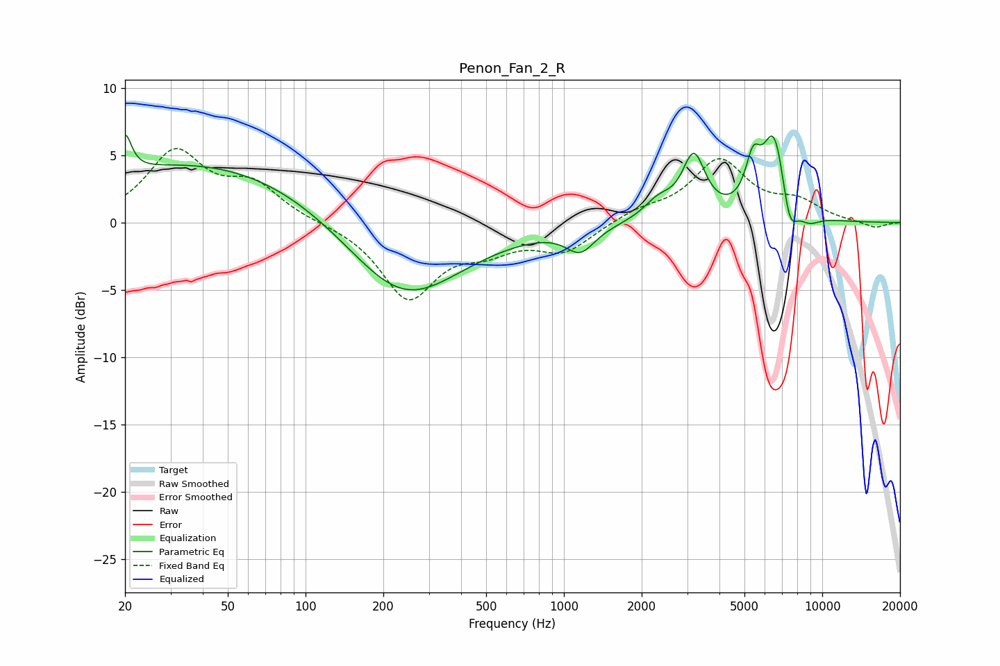

# Penon_Fan_2_R
See [usage instructions](https://github.com/jaakkopasanen/AutoEq#usage) for more options and info.

### Parametric EQs
Apply preamp of -6.6 dB when using parametric equalizer.

|   # | Type    |   Fc (Hz) |    Q |   Gain (dB) |
|-----|---------|-----------|------|-------------|
|   1 | Peaking |        20 | 5.84 |         2.8 |
|   2 | Peaking |        41 | 0.28 |         4.6 |
|   3 | Peaking |       238 | 0.63 |        -6.2 |
|   4 | Peaking |      1159 | 2.56 |        -1.8 |
|   5 | Peaking |      2323 | 2.42 |         1.4 |
|   6 | Peaking |      3182 | 3.19 |         4.6 |
|   7 | Peaking |      5395 | 4.84 |         3.1 |
|   8 | Peaking |      6519 | 2.91 |         6.6 |
|   9 | Peaking |      7470 | 4.5  |        -2.9 |
|  10 | Peaking |      8862 | 3.11 |        -0.7 |

### Fixed Band EQs
When using fixed band (also called graphic) equalizer, apply preamp of **-5.6 dB** (if available) and set gains manually with these parameters.

|   # | Type    |   Fc (Hz) |    Q |   Gain (dB) |
|-----|---------|-----------|------|-------------|
|   1 | Peaking |        31 | 1.41 |         5.1 |
|   2 | Peaking |        62 | 1.41 |         2.6 |
|   3 | Peaking |       125 | 1.41 |        -0   |
|   4 | Peaking |       250 | 1.41 |        -5.5 |
|   5 | Peaking |       500 | 1.41 |        -1.5 |
|   6 | Peaking |      1000 | 1.41 |        -2   |
|   7 | Peaking |      2000 | 1.41 |         0.8 |
|   8 | Peaking |      4000 | 1.41 |         4.5 |
|   9 | Peaking |      8000 | 1.41 |         1.3 |
|  10 | Peaking |     16000 | 1.41 |        -0.4 |

### Graphs

