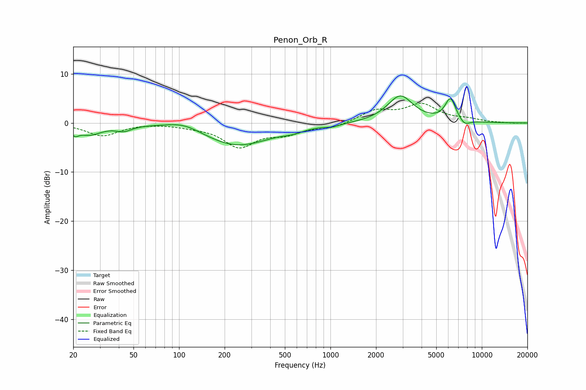

# Penon_Orb_R
See [usage instructions](https://github.com/jaakkopasanen/AutoEq#usage) for more options and info.

### Parametric EQs
Apply preamp of -5.6 dB when using parametric equalizer.

|   # | Type    |   Fc (Hz) |    Q |   Gain (dB) |
|-----|---------|-----------|------|-------------|
|   1 | Peaking |        20 | 5.96 |        -1.3 |
|   2 | Peaking |        26 | 1.72 |        -2.2 |
|   3 | Peaking |        43 | 2.69 |        -1.1 |
|   4 | Peaking |       107 | 1.25 |         1.5 |
|   5 | Peaking |       241 | 0.64 |        -4.7 |
|   6 | Peaking |       566 | 2.17 |        -0.6 |
|   7 | Peaking |      1037 | 3    |        -0.5 |
|   8 | Peaking |      2893 | 1.66 |         5.5 |
|   9 | Peaking |      6207 | 3.79 |         4.7 |
|  10 | Peaking |      7674 | 3.83 |        -1.2 |

### Fixed Band EQs
When using fixed band (also called graphic) equalizer, apply preamp of **-4.1 dB** (if available) and set gains manually with these parameters.

|   # | Type    |   Fc (Hz) |    Q |   Gain (dB) |
|-----|---------|-----------|------|-------------|
|   1 | Peaking |        31 | 1.41 |        -2.6 |
|   2 | Peaking |        62 | 1.41 |         0.1 |
|   3 | Peaking |       125 | 1.41 |        -0.5 |
|   4 | Peaking |       250 | 1.41 |        -4.7 |
|   5 | Peaking |       500 | 1.41 |        -1.9 |
|   6 | Peaking |      1000 | 1.41 |        -1   |
|   7 | Peaking |      2000 | 1.41 |         2.4 |
|   8 | Peaking |      4000 | 1.41 |         3.6 |
|   9 | Peaking |      8000 | 1.41 |         0.6 |
|  10 | Peaking |     16000 | 1.41 |        -0.1 |

### Graphs

