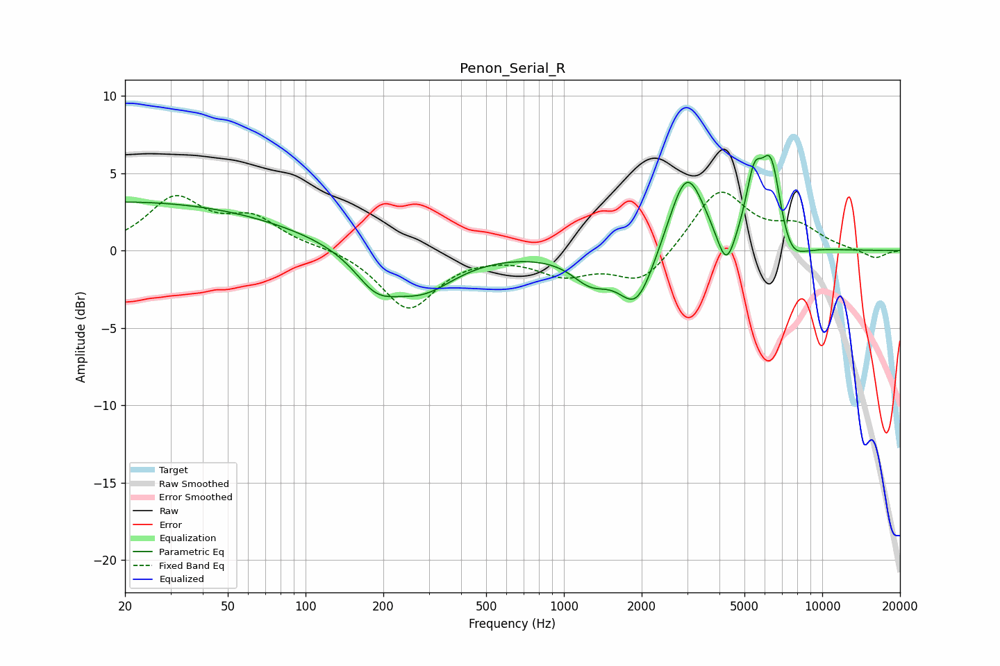

# Penon_Serial_R
See [usage instructions](https://github.com/jaakkopasanen/AutoEq#usage) for more options and info.

### Parametric EQs
Apply preamp of -6.2 dB when using parametric equalizer.

|   # | Type    |   Fc (Hz) |    Q |   Gain (dB) |
|-----|---------|-----------|------|-------------|
|   1 | Peaking |        20 | 0.21 |         3.2 |
|   2 | Peaking |       187 | 1.7  |        -2   |
|   3 | Peaking |       281 | 1.09 |        -2.5 |
|   4 | Peaking |      1270 | 1.91 |        -1.6 |
|   5 | Peaking |      1915 | 2    |        -3.7 |
|   6 | Peaking |      2985 | 2.02 |         5.4 |
|   7 | Peaking |      4250 | 3.91 |        -2.6 |
|   8 | Peaking |      5441 | 4.33 |         3.5 |
|   9 | Peaking |      6352 | 3.22 |         6   |
|  10 | Peaking |      7388 | 2.35 |        -2.1 |

### Fixed Band EQs
When using fixed band (also called graphic) equalizer, apply preamp of **-3.9 dB** (if available) and set gains manually with these parameters.

|   # | Type    |   Fc (Hz) |    Q |   Gain (dB) |
|-----|---------|-----------|------|-------------|
|   1 | Peaking |        31 | 1.41 |         3.2 |
|   2 | Peaking |        62 | 1.41 |         1.9 |
|   3 | Peaking |       125 | 1.41 |         0.2 |
|   4 | Peaking |       250 | 1.41 |        -3.8 |
|   5 | Peaking |       500 | 1.41 |        -0.1 |
|   6 | Peaking |      1000 | 1.41 |        -1.4 |
|   7 | Peaking |      2000 | 1.41 |        -2.1 |
|   8 | Peaking |      4000 | 1.41 |         4   |
|   9 | Peaking |      8000 | 1.41 |         1.4 |
|  10 | Peaking |     16000 | 1.41 |        -0.6 |

### Graphs

