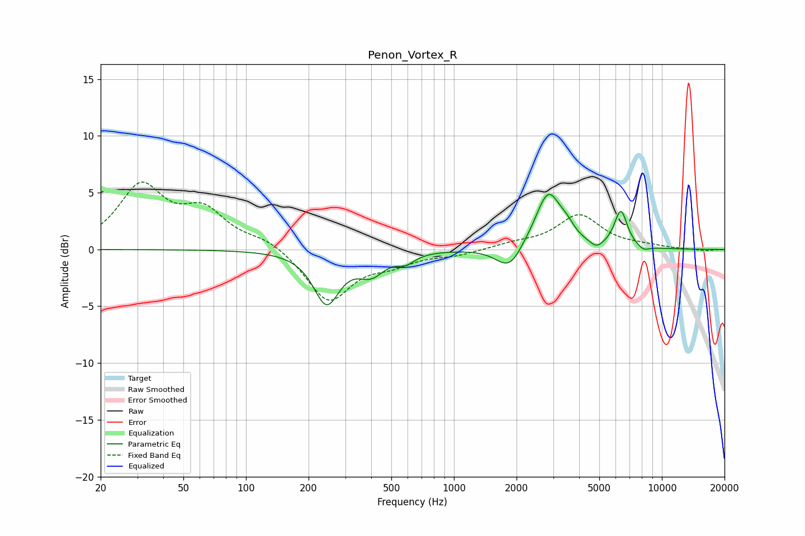

# Penon_Vortex_R
See [usage instructions](https://github.com/jaakkopasanen/AutoEq#usage) for more options and info.

### Parametric EQs
Apply preamp of -5.0 dB when using parametric equalizer.

|   # | Type    |   Fc (Hz) |    Q |   Gain (dB) |
|-----|---------|-----------|------|-------------|
|   1 | Peaking |       244 | 2.27 |        -4.6 |
|   2 | Peaking |       400 | 2.22 |        -1.8 |
|   3 | Peaking |       587 | 3.35 |        -0.8 |
|   4 | Peaking |      1819 | 2.27 |        -1.8 |
|   5 | Peaking |      1941 | 3.61 |        -0.3 |
|   6 | Peaking |      2846 | 2.27 |         5   |
|   7 | Peaking |      3507 | 4.3  |         0.7 |
|   8 | Peaking |      4855 | 4.34 |        -0.6 |
|   9 | Peaking |      6346 | 4.4  |         3.3 |
|  10 | Peaking |      8156 | 4.59 |        -0.4 |

### Fixed Band EQs
When using fixed band (also called graphic) equalizer, apply preamp of **-6.0 dB** (if available) and set gains manually with these parameters.

|   # | Type    |   Fc (Hz) |    Q |   Gain (dB) |
|-----|---------|-----------|------|-------------|
|   1 | Peaking |        31 | 1.41 |         5.4 |
|   2 | Peaking |        62 | 1.41 |         3   |
|   3 | Peaking |       125 | 1.41 |         0.9 |
|   4 | Peaking |       250 | 1.41 |        -4.6 |
|   5 | Peaking |       500 | 1.41 |        -1   |
|   6 | Peaking |      1000 | 1.41 |        -0.4 |
|   7 | Peaking |      2000 | 1.41 |         0.4 |
|   8 | Peaking |      4000 | 1.41 |         3   |
|   9 | Peaking |      8000 | 1.41 |         0.2 |
|  10 | Peaking |     16000 | 1.41 |        -0.1 |

### Graphs

