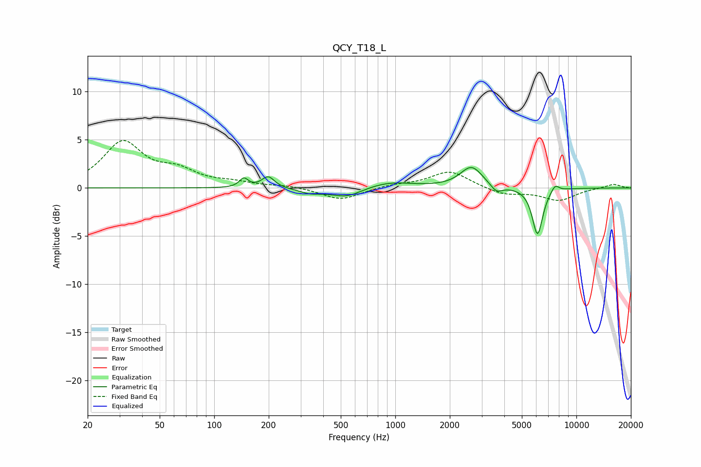

# QCY_T18_L
See [usage instructions](https://github.com/jaakkopasanen/AutoEq#usage) for more options and info.

### Parametric EQs
Apply preamp of -2.2 dB when using parametric equalizer.

|   # | Type    |   Fc (Hz) |    Q |   Gain (dB) |
|-----|---------|-----------|------|-------------|
|   1 | Peaking |       146 | 5.99 |         0.9 |
|   2 | Peaking |       199 | 4.08 |         1.2 |
|   3 | Peaking |       337 | 2.62 |        -0.4 |
|   4 | Peaking |       520 | 1.17 |        -0.7 |
|   5 | Peaking |       548 | 2.35 |        -0.3 |
|   6 | Peaking |       913 | 1.09 |         0.7 |
|   7 | Peaking |      2636 | 2.3  |         2.2 |
|   8 | Peaking |      3619 | 4.32 |        -0.8 |
|   9 | Peaking |      6100 | 4.76 |        -4.9 |
|  10 | Peaking |      7619 | 6    |         0.8 |

### Fixed Band EQs
When using fixed band (also called graphic) equalizer, apply preamp of **-5.0 dB** (if available) and set gains manually with these parameters.

|   # | Type    |   Fc (Hz) |    Q |   Gain (dB) |
|-----|---------|-----------|------|-------------|
|   1 | Peaking |        31 | 1.41 |         4.6 |
|   2 | Peaking |        62 | 1.41 |         1.5 |
|   3 | Peaking |       125 | 1.41 |         0.5 |
|   4 | Peaking |       250 | 1.41 |         0.2 |
|   5 | Peaking |       500 | 1.41 |        -1.3 |
|   6 | Peaking |      1000 | 1.41 |         0.3 |
|   7 | Peaking |      2000 | 1.41 |         1.8 |
|   8 | Peaking |      4000 | 1.41 |        -0.7 |
|   9 | Peaking |      8000 | 1.41 |        -1.3 |
|  10 | Peaking |     16000 | 1.41 |         0.4 |

### Graphs

