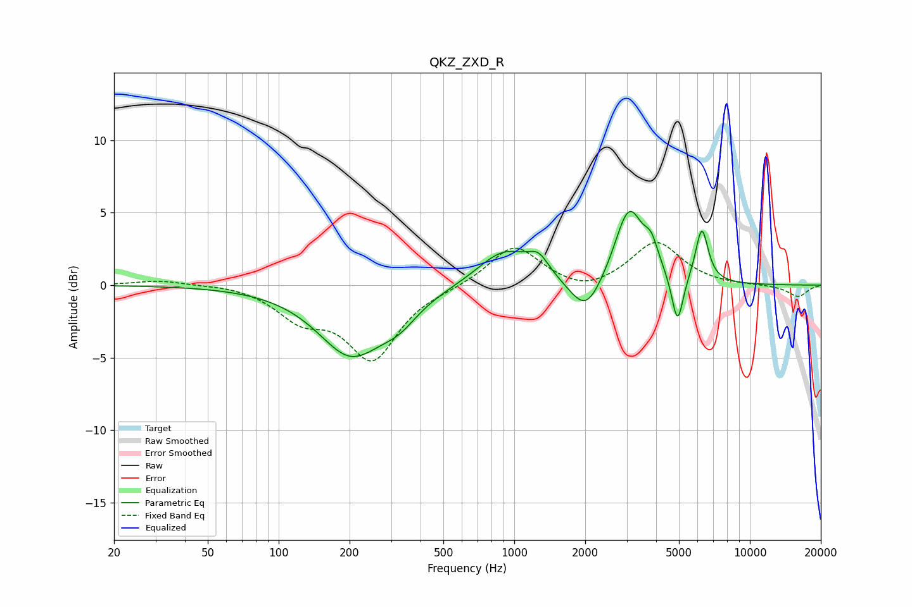

# QKZ_ZXD_R
See [usage instructions](https://github.com/jaakkopasanen/AutoEq#usage) for more options and info.

### Parametric EQs
Apply preamp of -5.2 dB when using parametric equalizer.

|   # | Type    |   Fc (Hz) |    Q |   Gain (dB) |
|-----|---------|-----------|------|-------------|
|   1 | Peaking |       206 | 1    |        -4.9 |
|   2 | Peaking |       228 | 2.14 |         0.2 |
|   3 | Peaking |       327 | 1.86 |        -1.1 |
|   4 | Peaking |       907 | 1.25 |         2.5 |
|   5 | Peaking |      1267 | 3.14 |         1.2 |
|   6 | Peaking |      2017 | 2.06 |        -2.6 |
|   7 | Peaking |      3068 | 2.33 |         5.3 |
|   8 | Peaking |      3817 | 4.68 |         1.6 |
|   9 | Peaking |      4931 | 5.77 |        -3.5 |
|  10 | Peaking |      6254 | 5.16 |         3.7 |

### Fixed Band EQs
When using fixed band (also called graphic) equalizer, apply preamp of **-3.0 dB** (if available) and set gains manually with these parameters.

|   # | Type    |   Fc (Hz) |    Q |   Gain (dB) |
|-----|---------|-----------|------|-------------|
|   1 | Peaking |        31 | 1.41 |         0.3 |
|   2 | Peaking |        62 | 1.41 |         0.1 |
|   3 | Peaking |       125 | 1.41 |        -2   |
|   4 | Peaking |       250 | 1.41 |        -4.9 |
|   5 | Peaking |       500 | 1.41 |        -0.1 |
|   6 | Peaking |      1000 | 1.41 |         2.8 |
|   7 | Peaking |      2000 | 1.41 |        -0.7 |
|   8 | Peaking |      4000 | 1.41 |         3   |
|   9 | Peaking |      8000 | 1.41 |        -0   |
|  10 | Peaking |     16000 | 1.41 |        -0.8 |

### Graphs

