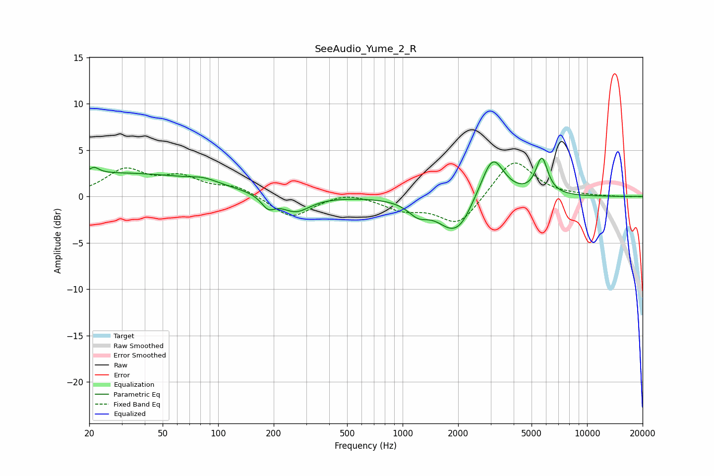

# SeeAudio_Yume_2_R
See [usage instructions](https://github.com/jaakkopasanen/AutoEq#usage) for more options and info.

### Parametric EQs
Apply preamp of -4.2 dB when using parametric equalizer.

|   # | Type    |   Fc (Hz) |    Q |   Gain (dB) |
|-----|---------|-----------|------|-------------|
|   1 | Peaking |        21 | 5.06 |         0.7 |
|   2 | Peaking |        29 | 0.28 |         2.5 |
|   3 | Peaking |        84 | 1.99 |         0.5 |
|   4 | Peaking |       187 | 3.82 |        -1.3 |
|   5 | Peaking |       262 | 1.78 |        -1.8 |
|   6 | Peaking |      1215 | 2.52 |        -1.4 |
|   7 | Peaking |      1875 | 1.61 |        -3.5 |
|   8 | Peaking |      2120 | 2.96 |        -0.7 |
|   9 | Peaking |      3074 | 2.28 |         4.7 |
|  10 | Peaking |      5686 | 4.3  |         3.9 |

### Fixed Band EQs
When using fixed band (also called graphic) equalizer, apply preamp of **-3.7 dB** (if available) and set gains manually with these parameters.

|   # | Type    |   Fc (Hz) |    Q |   Gain (dB) |
|-----|---------|-----------|------|-------------|
|   1 | Peaking |        31 | 1.41 |         2.7 |
|   2 | Peaking |        62 | 1.41 |         1.8 |
|   3 | Peaking |       125 | 1.41 |         1   |
|   4 | Peaking |       250 | 1.41 |        -2.3 |
|   5 | Peaking |       500 | 1.41 |         0.6 |
|   6 | Peaking |      1000 | 1.41 |        -1.3 |
|   7 | Peaking |      2000 | 1.41 |        -3.1 |
|   8 | Peaking |      4000 | 1.41 |         4.2 |
|   9 | Peaking |      8000 | 1.41 |         0.1 |
|  10 | Peaking |     16000 | 1.41 |        -0   |

### Graphs

