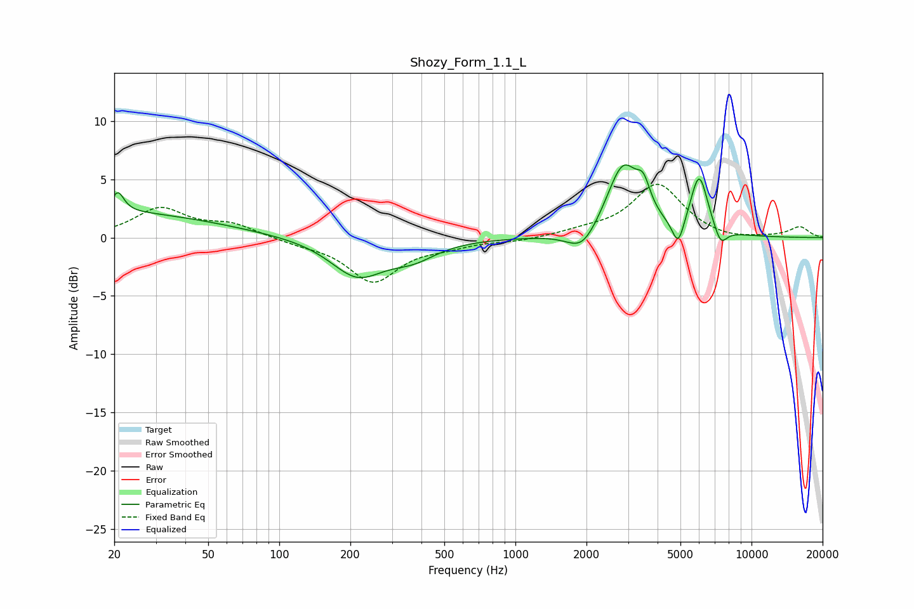

# Shozy_Form_1.1_L
See [usage instructions](https://github.com/jaakkopasanen/AutoEq#usage) for more options and info.

### Parametric EQs
Apply preamp of -6.3 dB when using parametric equalizer.

|   # | Type    |   Fc (Hz) |    Q |   Gain (dB) |
|-----|---------|-----------|------|-------------|
|   1 | Peaking |        20 | 0.33 |         2.2 |
|   2 | Peaking |        21 | 5.7  |         1.7 |
|   3 | Peaking |       214 | 1.25 |        -3.2 |
|   4 | Peaking |       369 | 1.42 |        -1.3 |
|   5 | Peaking |      1922 | 2.2  |        -2   |
|   6 | Peaking |      2858 | 2    |         6.2 |
|   7 | Peaking |      3488 | 4.99 |         2   |
|   8 | Peaking |      4890 | 5.46 |        -2.4 |
|   9 | Peaking |      6003 | 3.71 |         5.1 |
|  10 | Peaking |      7398 | 4.94 |        -1.5 |

### Fixed Band EQs
When using fixed band (also called graphic) equalizer, apply preamp of **-4.7 dB** (if available) and set gains manually with these parameters.

|   # | Type    |   Fc (Hz) |    Q |   Gain (dB) |
|-----|---------|-----------|------|-------------|
|   1 | Peaking |        31 | 1.41 |         2.4 |
|   2 | Peaking |        62 | 1.41 |         1.1 |
|   3 | Peaking |       125 | 1.41 |        -0.4 |
|   4 | Peaking |       250 | 1.41 |        -3.7 |
|   5 | Peaking |       500 | 1.41 |        -0.6 |
|   6 | Peaking |      1000 | 1.41 |        -0.3 |
|   7 | Peaking |      2000 | 1.41 |         0.4 |
|   8 | Peaking |      4000 | 1.41 |         4.6 |
|   9 | Peaking |      8000 | 1.41 |        -0.3 |
|  10 | Peaking |     16000 | 1.41 |         0.9 |

### Graphs

