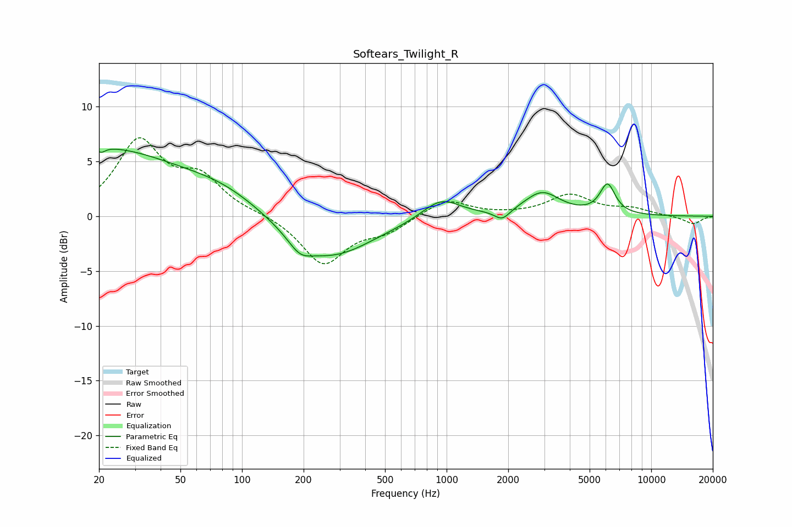

# Softears_Twilight_R
See [usage instructions](https://github.com/jaakkopasanen/AutoEq#usage) for more options and info.

### Parametric EQs
Apply preamp of -6.2 dB when using parametric equalizer.

|   # | Type    |   Fc (Hz) |    Q |   Gain (dB) |
|-----|---------|-----------|------|-------------|
|   1 | Peaking |        20 | 0.36 |         6.1 |
|   2 | Peaking |        20 | 5.67 |         3.4 |
|   3 | Peaking |        20 | 5.96 |        -3.7 |
|   4 | Peaking |        82 | 0.7  |         1.6 |
|   5 | Peaking |       191 | 2.52 |        -1.2 |
|   6 | Peaking |       264 | 0.67 |        -3.9 |
|   7 | Peaking |       939 | 1.52 |         1.9 |
|   8 | Peaking |      1870 | 3.76 |        -0.9 |
|   9 | Peaking |      2928 | 1.61 |         2.1 |
|  10 | Peaking |      6115 | 3.64 |         2.7 |

### Fixed Band EQs
When using fixed band (also called graphic) equalizer, apply preamp of **-7.3 dB** (if available) and set gains manually with these parameters.

|   # | Type    |   Fc (Hz) |    Q |   Gain (dB) |
|-----|---------|-----------|------|-------------|
|   1 | Peaking |        31 | 1.41 |         6.6 |
|   2 | Peaking |        62 | 1.41 |         3.1 |
|   3 | Peaking |       125 | 1.41 |         0.2 |
|   4 | Peaking |       250 | 1.41 |        -4.4 |
|   5 | Peaking |       500 | 1.41 |        -1.3 |
|   6 | Peaking |      1000 | 1.41 |         1.6 |
|   7 | Peaking |      2000 | 1.41 |         0.1 |
|   8 | Peaking |      4000 | 1.41 |         1.9 |
|   9 | Peaking |      8000 | 1.41 |         0.6 |
|  10 | Peaking |     16000 | 1.41 |        -0.7 |

### Graphs

