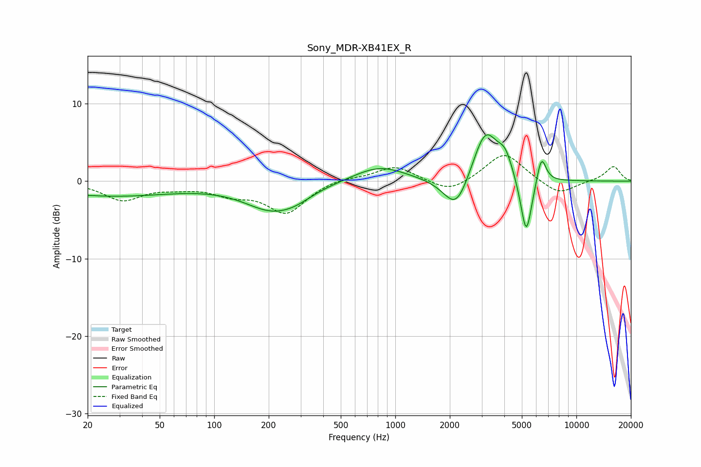

# Sony_MDR-XB41EX_R
See [usage instructions](https://github.com/jaakkopasanen/AutoEq#usage) for more options and info.

### Parametric EQs
Apply preamp of -6.1 dB when using parametric equalizer.

|   # | Type    |   Fc (Hz) |    Q |   Gain (dB) |
|-----|---------|-----------|------|-------------|
|   1 | Peaking |        21 | 3.28 |         0   |
|   2 | Peaking |        25 | 0.36 |        -1.9 |
|   3 | Peaking |       210 | 0.91 |        -3.5 |
|   4 | Peaking |       284 | 1.59 |        -0.7 |
|   5 | Peaking |       816 | 0.99 |         2   |
|   6 | Peaking |      2175 | 1.98 |        -4.7 |
|   7 | Peaking |      3143 | 1.95 |         6.9 |
|   8 | Peaking |      4051 | 3.51 |         2.4 |
|   9 | Peaking |      5286 | 4.33 |        -7.9 |
|  10 | Peaking |      6407 | 5.26 |         3.7 |

### Fixed Band EQs
When using fixed band (also called graphic) equalizer, apply preamp of **-3.4 dB** (if available) and set gains manually with these parameters.

|   # | Type    |   Fc (Hz) |    Q |   Gain (dB) |
|-----|---------|-----------|------|-------------|
|   1 | Peaking |        31 | 1.41 |        -2.4 |
|   2 | Peaking |        62 | 1.41 |        -0.6 |
|   3 | Peaking |       125 | 1.41 |        -1.4 |
|   4 | Peaking |       250 | 1.41 |        -4   |
|   5 | Peaking |       500 | 1.41 |         0.5 |
|   6 | Peaking |      1000 | 1.41 |         2   |
|   7 | Peaking |      2000 | 1.41 |        -1.6 |
|   8 | Peaking |      4000 | 1.41 |         3.8 |
|   9 | Peaking |      8000 | 1.41 |        -1.8 |
|  10 | Peaking |     16000 | 1.41 |         1.9 |

### Graphs

