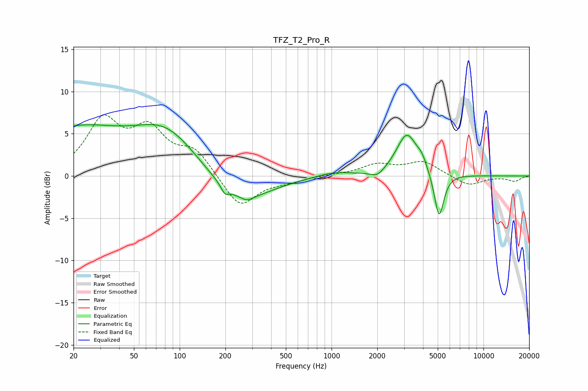

# TFZ_T2_Pro_R
See [usage instructions](https://github.com/jaakkopasanen/AutoEq#usage) for more options and info.

### Parametric EQs
Apply preamp of -6.2 dB when using parametric equalizer.

|   # | Type    |   Fc (Hz) |    Q |   Gain (dB) |
|-----|---------|-----------|------|-------------|
|   1 | Peaking |        20 | 0.43 |         5.3 |
|   2 | Peaking |        82 | 0.68 |         4.9 |
|   3 | Peaking |       198 | 5.92 |        -0.9 |
|   4 | Peaking |       246 | 0.72 |        -3.5 |
|   5 | Peaking |       278 | 3.85 |        -0.5 |
|   6 | Peaking |      1024 | 1.25 |         0.6 |
|   7 | Peaking |      2004 | 3.14 |        -0.8 |
|   8 | Peaking |      3133 | 2.06 |         5   |
|   9 | Peaking |      3940 | 4.45 |         1   |
|  10 | Peaking |      5102 | 4.39 |        -5.5 |

### Fixed Band EQs
When using fixed band (also called graphic) equalizer, apply preamp of **-7.3 dB** (if available) and set gains manually with these parameters.

|   # | Type    |   Fc (Hz) |    Q |   Gain (dB) |
|-----|---------|-----------|------|-------------|
|   1 | Peaking |        31 | 1.41 |         6.2 |
|   2 | Peaking |        62 | 1.41 |         4.9 |
|   3 | Peaking |       125 | 1.41 |         2.8 |
|   4 | Peaking |       250 | 1.41 |        -3.8 |
|   5 | Peaking |       500 | 1.41 |        -0.6 |
|   6 | Peaking |      1000 | 1.41 |         0.1 |
|   7 | Peaking |      2000 | 1.41 |         1.3 |
|   8 | Peaking |      4000 | 1.41 |         1.7 |
|   9 | Peaking |      8000 | 1.41 |        -1.2 |
|  10 | Peaking |     16000 | 1.41 |        -0.6 |

### Graphs

