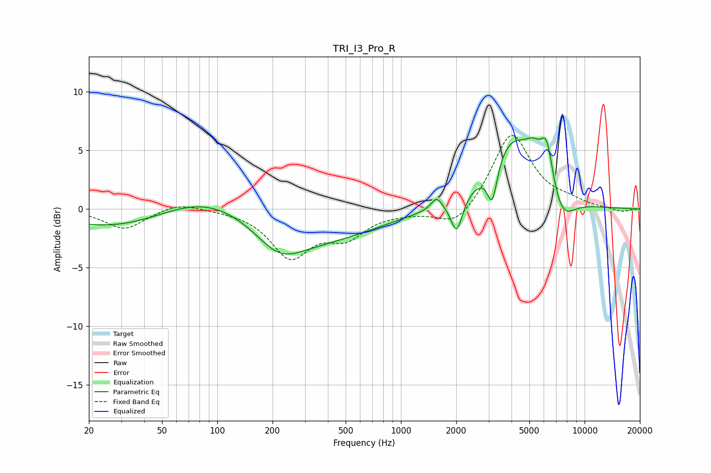

# TRI_I3_Pro_R
See [usage instructions](https://github.com/jaakkopasanen/AutoEq#usage) for more options and info.

### Parametric EQs
Apply preamp of -6.2 dB when using parametric equalizer.

|   # | Type    |   Fc (Hz) |    Q |   Gain (dB) |
|-----|---------|-----------|------|-------------|
|   1 | Peaking |        89 | 0.43 |         5.4 |
|   2 | Peaking |       110 | 0.18 |        -4.9 |
|   3 | Peaking |       218 | 1.13 |        -2.2 |
|   4 | Peaking |      1564 | 5.02 |         1   |
|   5 | Peaking |      2011 | 4.55 |        -3   |
|   6 | Peaking |      3142 | 5.1  |        -3.4 |
|   7 | Peaking |      3986 | 1.07 |         5.8 |
|   8 | Peaking |      5267 | 3.06 |         1.6 |
|   9 | Peaking |      6219 | 3.96 |         3.8 |
|  10 | Peaking |      7504 | 1.98 |        -2.4 |

### Fixed Band EQs
When using fixed band (also called graphic) equalizer, apply preamp of **-6.4 dB** (if available) and set gains manually with these parameters.

|   # | Type    |   Fc (Hz) |    Q |   Gain (dB) |
|-----|---------|-----------|------|-------------|
|   1 | Peaking |        31 | 1.41 |        -1.7 |
|   2 | Peaking |        62 | 1.41 |         0.6 |
|   3 | Peaking |       125 | 1.41 |        -0   |
|   4 | Peaking |       250 | 1.41 |        -3.9 |
|   5 | Peaking |       500 | 1.41 |        -2.1 |
|   6 | Peaking |      1000 | 1.41 |        -0.2 |
|   7 | Peaking |      2000 | 1.41 |        -1.7 |
|   8 | Peaking |      4000 | 1.41 |         6.5 |
|   9 | Peaking |      8000 | 1.41 |         0.5 |
|  10 | Peaking |     16000 | 1.41 |        -0.3 |

### Graphs

