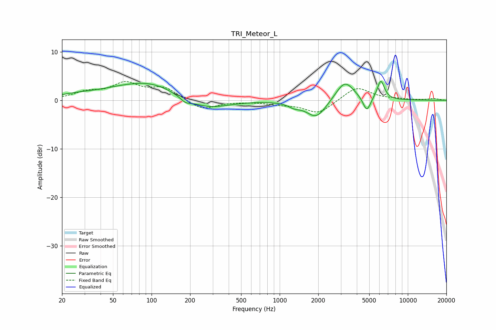

# TRI_Meteor_L
See [usage instructions](https://github.com/jaakkopasanen/AutoEq#usage) for more options and info.

### Parametric EQs
Apply preamp of -4.0 dB when using parametric equalizer.

|   # | Type    |   Fc (Hz) |    Q |   Gain (dB) |
|-----|---------|-----------|------|-------------|
|   1 | Peaking |        26 | 0.85 |         0.9 |
|   2 | Peaking |        53 | 0.87 |         0.9 |
|   3 | Peaking |        98 | 0.68 |         3.3 |
|   4 | Peaking |       184 | 3.51 |        -0.9 |
|   5 | Peaking |       270 | 0.87 |        -2.1 |
|   6 | Peaking |      1301 | 3.08 |        -0.8 |
|   7 | Peaking |      1931 | 1.8  |        -3.7 |
|   8 | Peaking |      3225 | 1.97 |         4.2 |
|   9 | Peaking |      4786 | 4.67 |        -3.1 |
|  10 | Peaking |      6153 | 4.83 |         4   |

### Fixed Band EQs
When using fixed band (also called graphic) equalizer, apply preamp of **-4.0 dB** (if available) and set gains manually with these parameters.

|   # | Type    |   Fc (Hz) |    Q |   Gain (dB) |
|-----|---------|-----------|------|-------------|
|   1 | Peaking |        31 | 1.41 |         1.5 |
|   2 | Peaking |        62 | 1.41 |         3.2 |
|   3 | Peaking |       125 | 1.41 |         2.4 |
|   4 | Peaking |       250 | 1.41 |        -2   |
|   5 | Peaking |       500 | 1.41 |        -0.1 |
|   6 | Peaking |      1000 | 1.41 |        -0.6 |
|   7 | Peaking |      2000 | 1.41 |        -2.7 |
|   8 | Peaking |      4000 | 1.41 |         2.8 |
|   9 | Peaking |      8000 | 1.41 |         0.2 |
|  10 | Peaking |     16000 | 1.41 |         0.3 |

### Graphs

