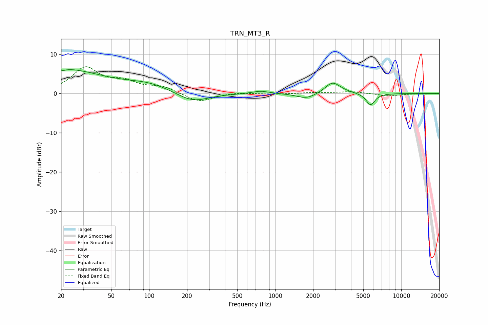

# TRN_MT3_R
See [usage instructions](https://github.com/jaakkopasanen/AutoEq#usage) for more options and info.

### Parametric EQs
Apply preamp of -6.2 dB when using parametric equalizer.

|   # | Type    |   Fc (Hz) |    Q |   Gain (dB) |
|-----|---------|-----------|------|-------------|
|   1 | Peaking |        20 | 0.43 |         6.1 |
|   2 | Peaking |        21 | 5.82 |         3.2 |
|   3 | Peaking |        21 | 5.94 |        -3.6 |
|   4 | Peaking |        99 | 0.77 |         2   |
|   5 | Peaking |       220 | 1.12 |        -2.5 |
|   6 | Peaking |       763 | 2.18 |         0.7 |
|   7 | Peaking |      1777 | 1.85 |        -1.4 |
|   8 | Peaking |      2834 | 2.47 |         2.5 |
|   9 | Peaking |      3088 | 1.79 |         0.5 |
|  10 | Peaking |      5705 | 3.96 |        -3   |

### Fixed Band EQs
When using fixed band (also called graphic) equalizer, apply preamp of **-6.9 dB** (if available) and set gains manually with these parameters.

|   # | Type    |   Fc (Hz) |    Q |   Gain (dB) |
|-----|---------|-----------|------|-------------|
|   1 | Peaking |        31 | 1.41 |         6.3 |
|   2 | Peaking |        62 | 1.41 |         2.5 |
|   3 | Peaking |       125 | 1.41 |         1.6 |
|   4 | Peaking |       250 | 1.41 |        -2.2 |
|   5 | Peaking |       500 | 1.41 |         0.3 |
|   6 | Peaking |      1000 | 1.41 |        -0.2 |
|   7 | Peaking |      2000 | 1.41 |         0.2 |
|   8 | Peaking |      4000 | 1.41 |         0.5 |
|   9 | Peaking |      8000 | 1.41 |        -0.6 |
|  10 | Peaking |     16000 | 1.41 |        -0.1 |

### Graphs

