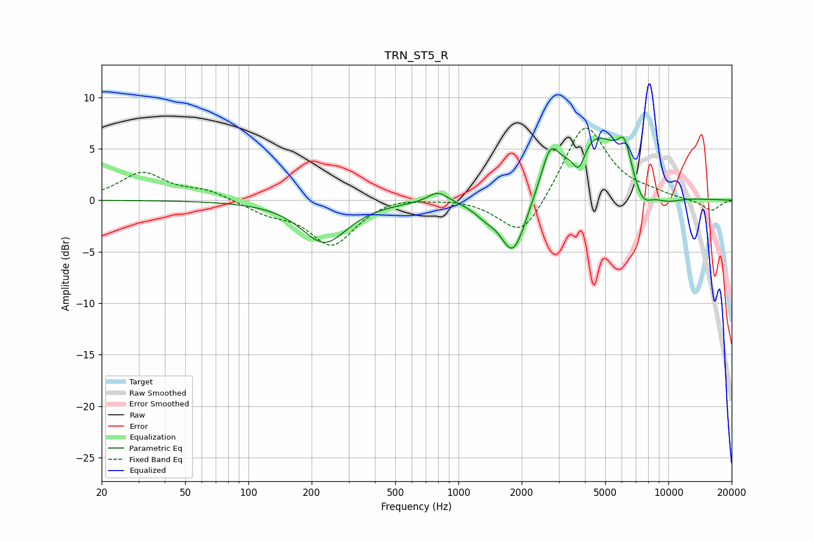

# TRN_ST5_R
See [usage instructions](https://github.com/jaakkopasanen/AutoEq#usage) for more options and info.

### Parametric EQs
Apply preamp of -6.2 dB when using parametric equalizer.

|   # | Type    |   Fc (Hz) |    Q |   Gain (dB) |
|-----|---------|-----------|------|-------------|
|   1 | Peaking |       230 | 1.31 |        -4.1 |
|   2 | Peaking |       798 | 3.01 |         1.1 |
|   3 | Peaking |      1338 | 2.64 |        -0.9 |
|   4 | Peaking |      1825 | 2.27 |        -5.9 |
|   5 | Peaking |      2731 | 3.47 |         3.5 |
|   6 | Peaking |      3749 | 4.71 |        -2.5 |
|   7 | Peaking |      4455 | 1.02 |         6.5 |
|   8 | Peaking |      6165 | 4.36 |         2.9 |
|   9 | Peaking |      7523 | 2.9  |        -2.2 |
|  10 | Peaking |      9715 | 1.58 |        -0.9 |

### Fixed Band EQs
When using fixed band (also called graphic) equalizer, apply preamp of **-7.1 dB** (if available) and set gains manually with these parameters.

|   # | Type    |   Fc (Hz) |    Q |   Gain (dB) |
|-----|---------|-----------|------|-------------|
|   1 | Peaking |        31 | 1.41 |         2.6 |
|   2 | Peaking |        62 | 1.41 |         0.9 |
|   3 | Peaking |       125 | 1.41 |        -1.1 |
|   4 | Peaking |       250 | 1.41 |        -4.3 |
|   5 | Peaking |       500 | 1.41 |         0.5 |
|   6 | Peaking |      1000 | 1.41 |         0.2 |
|   7 | Peaking |      2000 | 1.41 |        -4   |
|   8 | Peaking |      4000 | 1.41 |         7.6 |
|   9 | Peaking |      8000 | 1.41 |         0.4 |
|  10 | Peaking |     16000 | 1.41 |        -1.1 |

### Graphs

