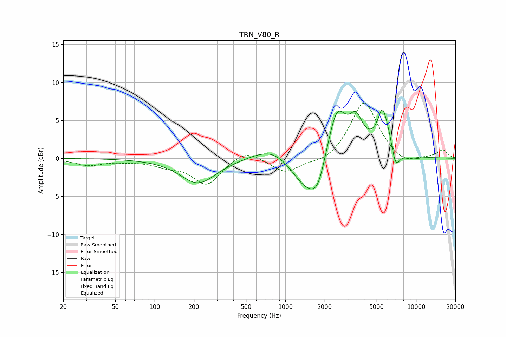

# TRN_V80_R
See [usage instructions](https://github.com/jaakkopasanen/AutoEq#usage) for more options and info.

### Parametric EQs
Apply preamp of -6.5 dB when using parametric equalizer.

|   # | Type    |   Fc (Hz) |    Q |   Gain (dB) |
|-----|---------|-----------|------|-------------|
|   1 | Peaking |       215 | 1.04 |        -3.3 |
|   2 | Peaking |       799 | 0.98 |         1.9 |
|   3 | Peaking |      1490 | 1.2  |        -4.8 |
|   4 | Peaking |      1777 | 2.73 |        -2.6 |
|   5 | Peaking |      2476 | 1.93 |         7.1 |
|   6 | Peaking |      3476 | 2.84 |         3.6 |
|   7 | Peaking |      5513 | 4.59 |         2.9 |
|   8 | Peaking |      6374 | 1.55 |         5.8 |
|   9 | Peaking |      6931 | 3.28 |        -5.5 |
|  10 | Peaking |      8662 | 1.59 |        -1.4 |

### Fixed Band EQs
When using fixed band (also called graphic) equalizer, apply preamp of **-7.4 dB** (if available) and set gains manually with these parameters.

|   # | Type    |   Fc (Hz) |    Q |   Gain (dB) |
|-----|---------|-----------|------|-------------|
|   1 | Peaking |        31 | 1.41 |        -0.9 |
|   2 | Peaking |        62 | 1.41 |        -0.3 |
|   3 | Peaking |       125 | 1.41 |        -0.8 |
|   4 | Peaking |       250 | 1.41 |        -3.4 |
|   5 | Peaking |       500 | 1.41 |         1.3 |
|   6 | Peaking |      1000 | 1.41 |        -1.9 |
|   7 | Peaking |      2000 | 1.41 |        -0.8 |
|   8 | Peaking |      4000 | 1.41 |         7.6 |
|   9 | Peaking |      8000 | 1.41 |        -1   |
|  10 | Peaking |     16000 | 1.41 |         1.1 |

### Graphs

