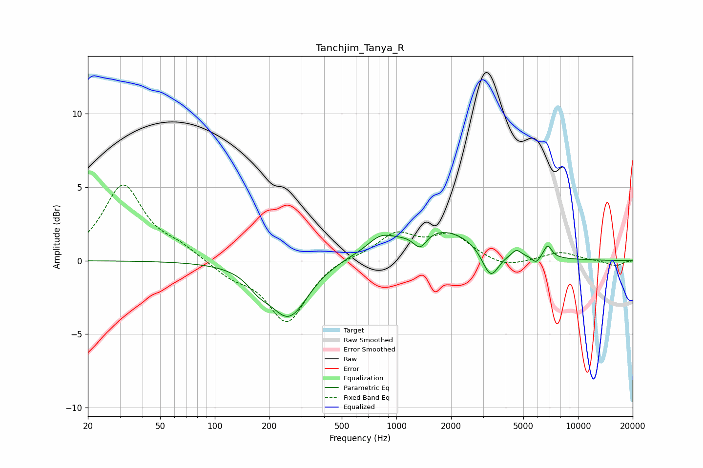

# Tanchjim_Tanya_R
See [usage instructions](https://github.com/jaakkopasanen/AutoEq#usage) for more options and info.

### Parametric EQs
Apply preamp of -2.0 dB when using parametric equalizer.

|   # | Type    |   Fc (Hz) |    Q |   Gain (dB) |
|-----|---------|-----------|------|-------------|
|   1 | Peaking |       174 | 2.41 |        -0.8 |
|   2 | Peaking |       256 | 1.34 |        -3.8 |
|   3 | Peaking |       510 | 1.3  |         0.1 |
|   4 | Peaking |       815 | 1.88 |         1   |
|   5 | Peaking |      1349 | 3.85 |        -1.1 |
|   6 | Peaking |      1738 | 0.66 |         2.2 |
|   7 | Peaking |      3299 | 3.03 |        -2.1 |
|   8 | Peaking |      4576 | 5.79 |         0.4 |
|   9 | Peaking |      5868 | 6    |        -0.5 |
|  10 | Peaking |      6807 | 6    |         0.9 |

### Fixed Band EQs
When using fixed band (also called graphic) equalizer, apply preamp of **-5.2 dB** (if available) and set gains manually with these parameters.

|   # | Type    |   Fc (Hz) |    Q |   Gain (dB) |
|-----|---------|-----------|------|-------------|
|   1 | Peaking |        31 | 1.41 |         5.1 |
|   2 | Peaking |        62 | 1.41 |         0.8 |
|   3 | Peaking |       125 | 1.41 |        -0.9 |
|   4 | Peaking |       250 | 1.41 |        -4.2 |
|   5 | Peaking |       500 | 1.41 |         0.3 |
|   6 | Peaking |      1000 | 1.41 |         1.8 |
|   7 | Peaking |      2000 | 1.41 |         1.6 |
|   8 | Peaking |      4000 | 1.41 |        -0.5 |
|   9 | Peaking |      8000 | 1.41 |         0.6 |
|  10 | Peaking |     16000 | 1.41 |        -0.4 |

### Graphs

