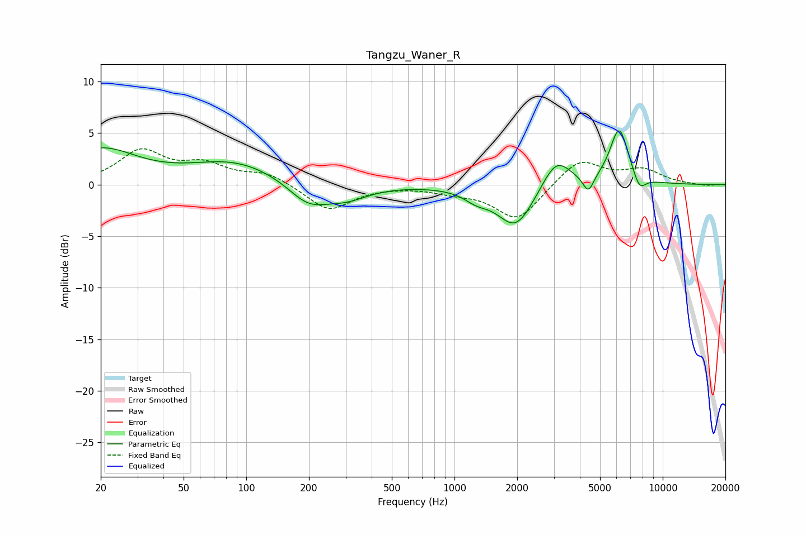

# Tangzu_Waner_R
See [usage instructions](https://github.com/jaakkopasanen/AutoEq#usage) for more options and info.

### Parametric EQs
Apply preamp of -5.3 dB when using parametric equalizer.

|   # | Type    |   Fc (Hz) |    Q |   Gain (dB) |
|-----|---------|-----------|------|-------------|
|   1 | Peaking |        20 | 0.82 |         3.3 |
|   2 | Peaking |        88 | 0.65 |         2.2 |
|   3 | Peaking |       198 | 1.46 |        -2.1 |
|   4 | Peaking |       301 | 1.3  |        -1.3 |
|   5 | Peaking |      1275 | 2.38 |        -0.9 |
|   6 | Peaking |      1968 | 1.61 |        -4.2 |
|   7 | Peaking |      3079 | 2.03 |         3   |
|   8 | Peaking |      4391 | 5.41 |        -1.7 |
|   9 | Peaking |      6178 | 3.07 |         5.5 |
|  10 | Peaking |      7739 | 4.53 |        -1.5 |

### Fixed Band EQs
When using fixed band (also called graphic) equalizer, apply preamp of **-3.6 dB** (if available) and set gains manually with these parameters.

|   # | Type    |   Fc (Hz) |    Q |   Gain (dB) |
|-----|---------|-----------|------|-------------|
|   1 | Peaking |        31 | 1.41 |         3.1 |
|   2 | Peaking |        62 | 1.41 |         1.7 |
|   3 | Peaking |       125 | 1.41 |         1.1 |
|   4 | Peaking |       250 | 1.41 |        -2.5 |
|   5 | Peaking |       500 | 1.41 |        -0   |
|   6 | Peaking |      1000 | 1.41 |        -0.6 |
|   7 | Peaking |      2000 | 1.41 |        -3.5 |
|   8 | Peaking |      4000 | 1.41 |         2.5 |
|   9 | Peaking |      8000 | 1.41 |         1.4 |
|  10 | Peaking |     16000 | 1.41 |        -0.1 |

### Graphs

