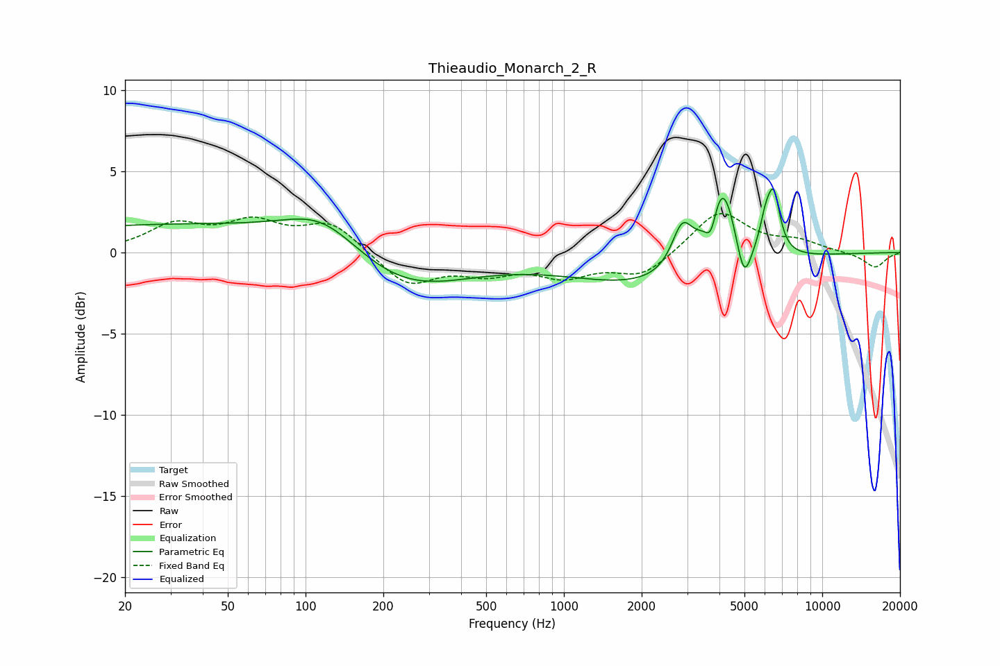

# Thieaudio_Monarch_2_R
See [usage instructions](https://github.com/jaakkopasanen/AutoEq#usage) for more options and info.

### Parametric EQs
Apply preamp of -4.0 dB when using parametric equalizer.

|   # | Type    |   Fc (Hz) |    Q |   Gain (dB) |
|-----|---------|-----------|------|-------------|
|   1 | Peaking |        35 | 0.18 |         1.7 |
|   2 | Peaking |       117 | 0.95 |         2.1 |
|   3 | Peaking |       232 | 0.57 |        -2.7 |
|   4 | Peaking |      2224 | 0.45 |        -2   |
|   5 | Peaking |      2868 | 3.53 |         2.6 |
|   6 | Peaking |      3716 | 6    |        -2   |
|   7 | Peaking |      4064 | 2.46 |         5.7 |
|   8 | Peaking |      4974 | 4.76 |        -2.8 |
|   9 | Peaking |      6040 | 6    |         1.7 |
|  10 | Peaking |      6499 | 5.67 |         3.4 |

### Fixed Band EQs
When using fixed band (also called graphic) equalizer, apply preamp of **-2.5 dB** (if available) and set gains manually with these parameters.

|   # | Type    |   Fc (Hz) |    Q |   Gain (dB) |
|-----|---------|-----------|------|-------------|
|   1 | Peaking |        31 | 1.41 |         1.6 |
|   2 | Peaking |        62 | 1.41 |         1.6 |
|   3 | Peaking |       125 | 1.41 |         1.8 |
|   4 | Peaking |       250 | 1.41 |        -2   |
|   5 | Peaking |       500 | 1.41 |        -1.1 |
|   6 | Peaking |      1000 | 1.41 |        -1.3 |
|   7 | Peaking |      2000 | 1.41 |        -1.4 |
|   8 | Peaking |      4000 | 1.41 |         2.6 |
|   9 | Peaking |      8000 | 1.41 |         0.6 |
|  10 | Peaking |     16000 | 1.41 |        -0.9 |

### Graphs

