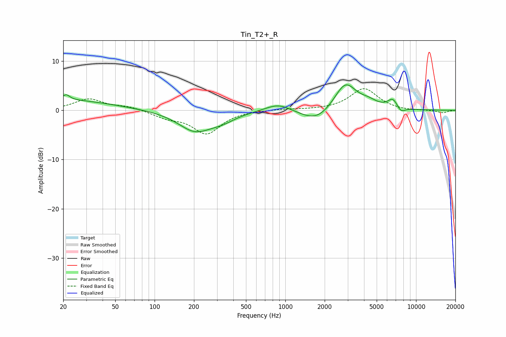

# Tin_T2+_R
See [usage instructions](https://github.com/jaakkopasanen/AutoEq#usage) for more options and info.

### Parametric EQs
Apply preamp of -5.3 dB when using parametric equalizer.

|   # | Type    |   Fc (Hz) |    Q |   Gain (dB) |
|-----|---------|-----------|------|-------------|
|   1 | Peaking |        20 | 0.39 |         2.1 |
|   2 | Peaking |        21 | 5.38 |         1.1 |
|   3 | Peaking |       204 | 1.09 |        -4.1 |
|   4 | Peaking |       332 | 1.43 |        -1.3 |
|   5 | Peaking |       883 | 1.46 |         1.6 |
|   6 | Peaking |      1739 | 1.18 |        -2.7 |
|   7 | Peaking |      2878 | 1.63 |         5.9 |
|   8 | Peaking |      4346 | 2.24 |         1   |
|   9 | Peaking |      6649 | 3.47 |         2   |
|  10 | Peaking |      7650 | 4.26 |        -1.2 |

### Fixed Band EQs
When using fixed band (also called graphic) equalizer, apply preamp of **-4.5 dB** (if available) and set gains manually with these parameters.

|   # | Type    |   Fc (Hz) |    Q |   Gain (dB) |
|-----|---------|-----------|------|-------------|
|   1 | Peaking |        31 | 1.41 |         2.3 |
|   2 | Peaking |        62 | 1.41 |         0.7 |
|   3 | Peaking |       125 | 1.41 |        -1.3 |
|   4 | Peaking |       250 | 1.41 |        -4.6 |
|   5 | Peaking |       500 | 1.41 |         0   |
|   6 | Peaking |      1000 | 1.41 |         0.3 |
|   7 | Peaking |      2000 | 1.41 |         0.1 |
|   8 | Peaking |      4000 | 1.41 |         4.4 |
|   9 | Peaking |      8000 | 1.41 |        -0.2 |
|  10 | Peaking |     16000 | 1.41 |        -0.5 |

### Graphs

