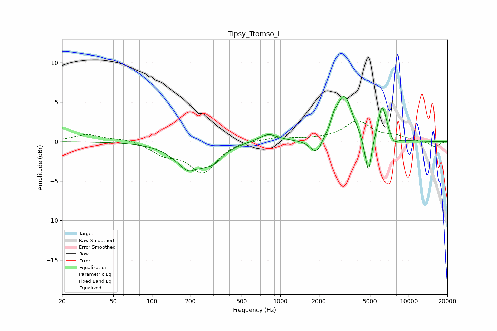

# Tipsy_Tromso_L
See [usage instructions](https://github.com/jaakkopasanen/AutoEq#usage) for more options and info.

### Parametric EQs
Apply preamp of -5.8 dB when using parametric equalizer.

|   # | Type    |   Fc (Hz) |    Q |   Gain (dB) |
|-----|---------|-----------|------|-------------|
|   1 | Peaking |       202 | 1.26 |        -3.7 |
|   2 | Peaking |       219 | 5.11 |         0.3 |
|   3 | Peaking |       306 | 2.27 |        -1.3 |
|   4 | Peaking |       807 | 1.9  |         1.1 |
|   5 | Peaking |      1909 | 2.93 |        -2.1 |
|   6 | Peaking |      2637 | 4.91 |         1   |
|   7 | Peaking |      3150 | 2.27 |         5.8 |
|   8 | Peaking |      4847 | 5.28 |        -5.2 |
|   9 | Peaking |      6229 | 4.16 |         4.5 |
|  10 | Peaking |      7732 | 4.8  |        -0.8 |

### Fixed Band EQs
When using fixed band (also called graphic) equalizer, apply preamp of **-2.7 dB** (if available) and set gains manually with these parameters.

|   # | Type    |   Fc (Hz) |    Q |   Gain (dB) |
|-----|---------|-----------|------|-------------|
|   1 | Peaking |        31 | 1.41 |         0.9 |
|   2 | Peaking |        62 | 1.41 |         0.4 |
|   3 | Peaking |       125 | 1.41 |        -1.4 |
|   4 | Peaking |       250 | 1.41 |        -3.8 |
|   5 | Peaking |       500 | 1.41 |         0.3 |
|   6 | Peaking |      1000 | 1.41 |         0.6 |
|   7 | Peaking |      2000 | 1.41 |         0.2 |
|   8 | Peaking |      4000 | 1.41 |         2.5 |
|   9 | Peaking |      8000 | 1.41 |         0.6 |
|  10 | Peaking |     16000 | 1.41 |        -0.7 |

### Graphs

