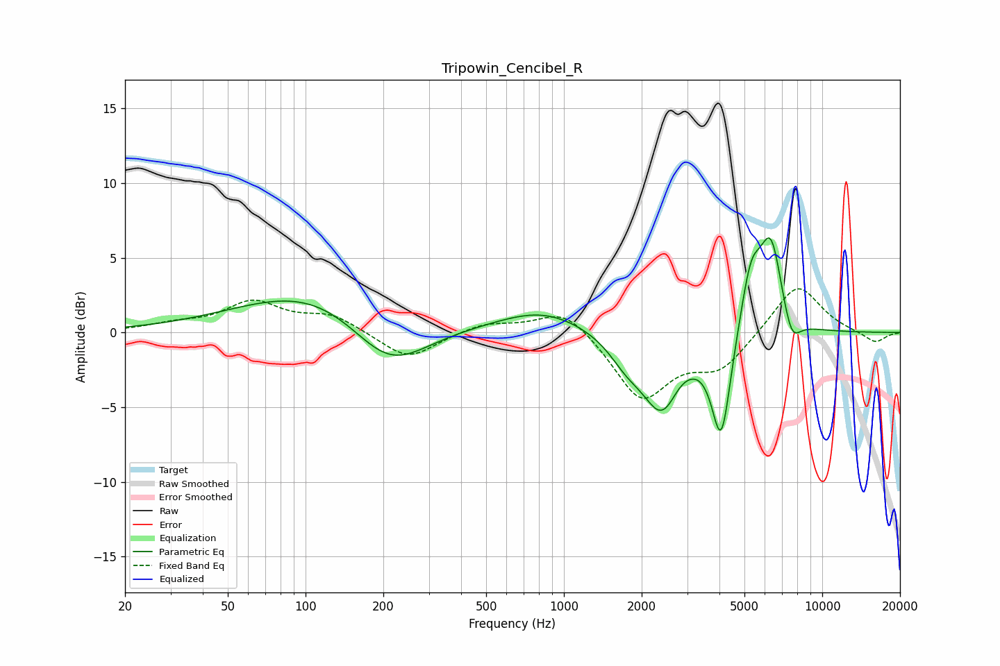

# Tripowin_Cencibel_R
See [usage instructions](https://github.com/jaakkopasanen/AutoEq#usage) for more options and info.

### Parametric EQs
Apply preamp of -6.4 dB when using parametric equalizer.

|   # | Type    |   Fc (Hz) |    Q |   Gain (dB) |
|-----|---------|-----------|------|-------------|
|   1 | Peaking |       119 | 0.47 |         3.3 |
|   2 | Peaking |       210 | 0.89 |        -4.1 |
|   3 | Peaking |       831 | 0.81 |         1.5 |
|   4 | Peaking |      1749 | 2.05 |        -1.4 |
|   5 | Peaking |      2414 | 1.81 |        -5.2 |
|   6 | Peaking |      2768 | 2.9  |         0.7 |
|   7 | Peaking |      4066 | 3.77 |        -7.1 |
|   8 | Peaking |      5297 | 3.28 |         4.2 |
|   9 | Peaking |      6338 | 3.07 |         5.9 |
|  10 | Peaking |      7596 | 3.88 |        -2   |

### Fixed Band EQs
When using fixed band (also called graphic) equalizer, apply preamp of **-3.0 dB** (if available) and set gains manually with these parameters.

|   # | Type    |   Fc (Hz) |    Q |   Gain (dB) |
|-----|---------|-----------|------|-------------|
|   1 | Peaking |        31 | 1.41 |         0.4 |
|   2 | Peaking |        62 | 1.41 |         1.9 |
|   3 | Peaking |       125 | 1.41 |         1.1 |
|   4 | Peaking |       250 | 1.41 |        -1.9 |
|   5 | Peaking |       500 | 1.41 |         0.7 |
|   6 | Peaking |      1000 | 1.41 |         1.7 |
|   7 | Peaking |      2000 | 1.41 |        -4.4 |
|   8 | Peaking |      4000 | 1.41 |        -2.3 |
|   9 | Peaking |      8000 | 1.41 |         3.4 |
|  10 | Peaking |     16000 | 1.41 |        -0.7 |

### Graphs

