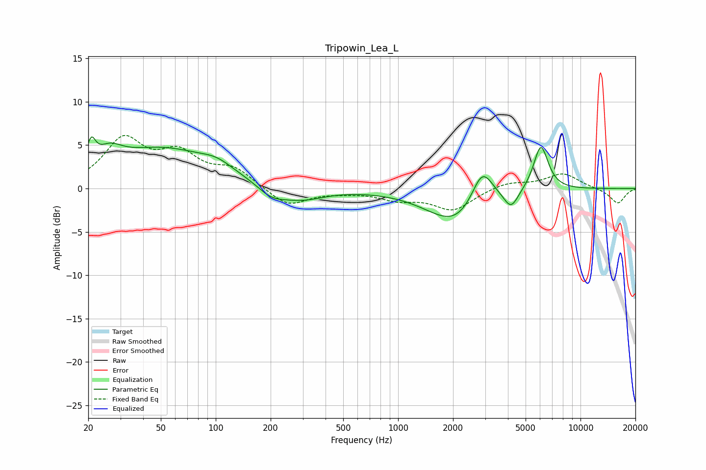

# Tripowin_Lea_L
See [usage instructions](https://github.com/jaakkopasanen/AutoEq#usage) for more options and info.

### Parametric EQs
Apply preamp of -6.0 dB when using parametric equalizer.

|   # | Type    |   Fc (Hz) |    Q |   Gain (dB) |
|-----|---------|-----------|------|-------------|
|   1 | Peaking |        21 | 5.99 |         2.6 |
|   2 | Peaking |        26 | 2.1  |         1.9 |
|   3 | Peaking |        51 | 0.48 |         4.5 |
|   4 | Peaking |       102 | 1.67 |         0.9 |
|   5 | Peaking |       201 | 1.89 |        -1.2 |
|   6 | Peaking |       290 | 1.08 |        -1.5 |
|   7 | Peaking |      2101 | 0.89 |        -4.2 |
|   8 | Peaking |      2891 | 2.32 |         4.5 |
|   9 | Peaking |      4161 | 3.59 |        -2   |
|  10 | Peaking |      6063 | 3.38 |         5.3 |

### Fixed Band EQs
When using fixed band (also called graphic) equalizer, apply preamp of **-6.2 dB** (if available) and set gains manually with these parameters.

|   # | Type    |   Fc (Hz) |    Q |   Gain (dB) |
|-----|---------|-----------|------|-------------|
|   1 | Peaking |        31 | 1.41 |         5.4 |
|   2 | Peaking |        62 | 1.41 |         3.5 |
|   3 | Peaking |       125 | 1.41 |         2.1 |
|   4 | Peaking |       250 | 1.41 |        -2.1 |
|   5 | Peaking |       500 | 1.41 |        -0.3 |
|   6 | Peaking |      1000 | 1.41 |        -1.1 |
|   7 | Peaking |      2000 | 1.41 |        -2.4 |
|   8 | Peaking |      4000 | 1.41 |         0.8 |
|   9 | Peaking |      8000 | 1.41 |         1.7 |
|  10 | Peaking |     16000 | 1.41 |        -1.7 |

### Graphs

