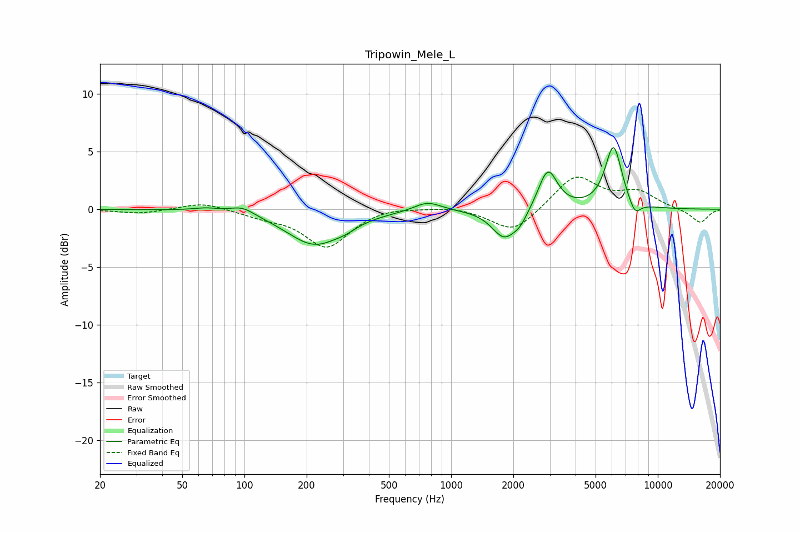

# Tripowin_Mele_L
See [usage instructions](https://github.com/jaakkopasanen/AutoEq#usage) for more options and info.

### Parametric EQs
Apply preamp of -5.4 dB when using parametric equalizer.

|   # | Type    |   Fc (Hz) |    Q |   Gain (dB) |
|-----|---------|-----------|------|-------------|
|   1 | Peaking |        65 | 2.23 |         0.3 |
|   2 | Peaking |        98 | 2.43 |         0.7 |
|   3 | Peaking |       218 | 1.06 |        -3   |
|   4 | Peaking |       309 | 2.64 |        -0.3 |
|   5 | Peaking |       769 | 2.13 |         0.8 |
|   6 | Peaking |      1804 | 2.38 |        -2.5 |
|   7 | Peaking |      2158 | 3.72 |        -0.9 |
|   8 | Peaking |      2937 | 3.09 |         3.5 |
|   9 | Peaking |      6104 | 3.39 |         5.4 |
|  10 | Peaking |      7737 | 4.61 |        -1.2 |

### Fixed Band EQs
When using fixed band (also called graphic) equalizer, apply preamp of **-2.9 dB** (if available) and set gains manually with these parameters.

|   # | Type    |   Fc (Hz) |    Q |   Gain (dB) |
|-----|---------|-----------|------|-------------|
|   1 | Peaking |        31 | 1.41 |        -0.4 |
|   2 | Peaking |        62 | 1.41 |         0.6 |
|   3 | Peaking |       125 | 1.41 |        -0.5 |
|   4 | Peaking |       250 | 1.41 |        -3.2 |
|   5 | Peaking |       500 | 1.41 |         0.3 |
|   6 | Peaking |      1000 | 1.41 |         0.3 |
|   7 | Peaking |      2000 | 1.41 |        -2.1 |
|   8 | Peaking |      4000 | 1.41 |         2.9 |
|   9 | Peaking |      8000 | 1.41 |         1.4 |
|  10 | Peaking |     16000 | 1.41 |        -1.2 |

### Graphs

