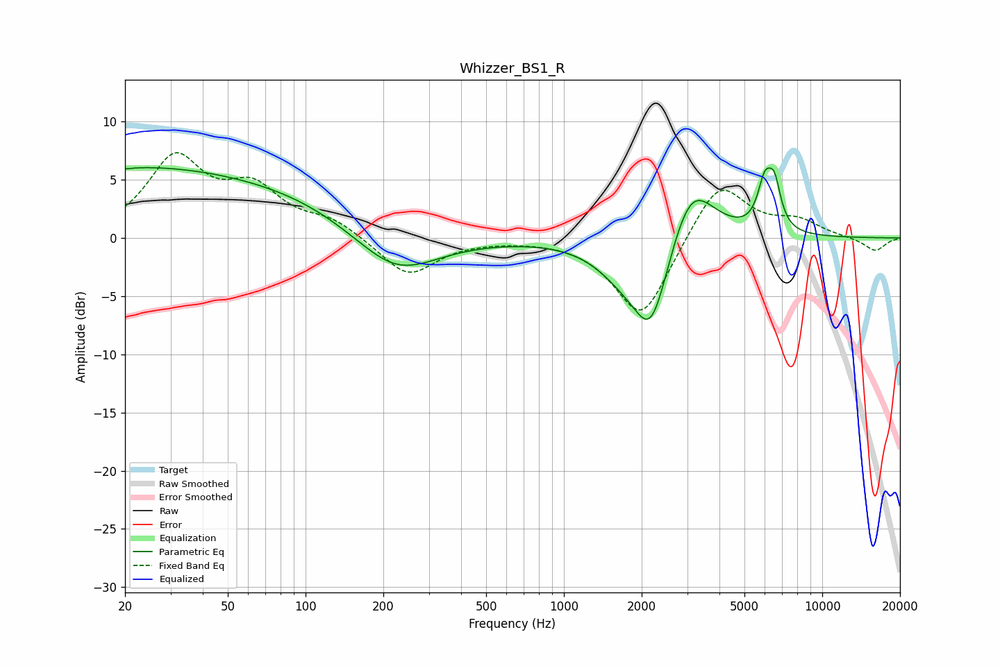

# Whizzer_BS1_R
See [usage instructions](https://github.com/jaakkopasanen/AutoEq#usage) for more options and info.

### Parametric EQs
Apply preamp of -6.1 dB when using parametric equalizer.

|   # | Type    |   Fc (Hz) |    Q |   Gain (dB) |
|-----|---------|-----------|------|-------------|
|   1 | Peaking |        20 | 5.88 |         3   |
|   2 | Peaking |        20 | 5.84 |        -3.1 |
|   3 | Peaking |        21 | 0.25 |         5.9 |
|   4 | Peaking |       104 | 0.56 |         1.2 |
|   5 | Peaking |       224 | 0.88 |        -3.7 |
|   6 | Peaking |      1678 | 1.33 |        -2.1 |
|   7 | Peaking |      2180 | 1.93 |        -8   |
|   8 | Peaking |      3090 | 1.55 |         6   |
|   9 | Peaking |      5987 | 5.04 |         3.7 |
|  10 | Peaking |      6531 | 5.52 |         3.5 |

### Fixed Band EQs
When using fixed band (also called graphic) equalizer, apply preamp of **-7.4 dB** (if available) and set gains manually with these parameters.

|   # | Type    |   Fc (Hz) |    Q |   Gain (dB) |
|-----|---------|-----------|------|-------------|
|   1 | Peaking |        31 | 1.41 |         6.6 |
|   2 | Peaking |        62 | 1.41 |         3.7 |
|   3 | Peaking |       125 | 1.41 |         1.4 |
|   4 | Peaking |       250 | 1.41 |        -3.3 |
|   5 | Peaking |       500 | 1.41 |        -0.1 |
|   6 | Peaking |      1000 | 1.41 |         0   |
|   7 | Peaking |      2000 | 1.41 |        -7.1 |
|   8 | Peaking |      4000 | 1.41 |         5.1 |
|   9 | Peaking |      8000 | 1.41 |         1.3 |
|  10 | Peaking |     16000 | 1.41 |        -1.2 |

### Graphs

