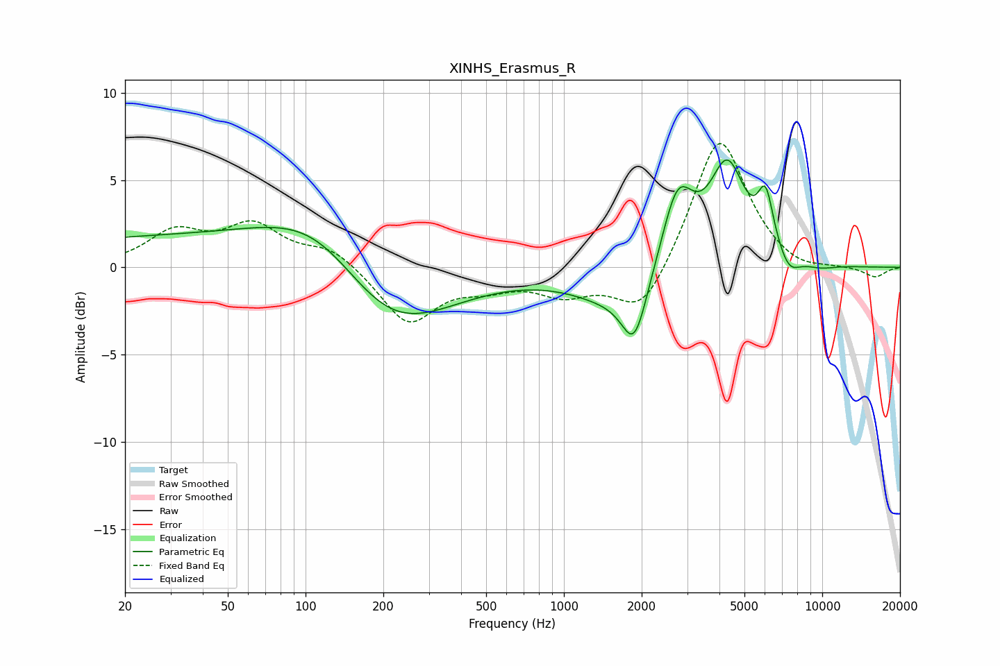

# XINHS_Erasmus_R
See [usage instructions](https://github.com/jaakkopasanen/AutoEq#usage) for more options and info.

### Parametric EQs
Apply preamp of -6.3 dB when using parametric equalizer.

|   # | Type    |   Fc (Hz) |    Q |   Gain (dB) |
|-----|---------|-----------|------|-------------|
|   1 | Peaking |        34 | 0.18 |         1.7 |
|   2 | Peaking |       117 | 0.65 |         3.4 |
|   3 | Peaking |       201 | 0.59 |        -5.1 |
|   4 | Peaking |      1566 | 0.85 |        -1.8 |
|   5 | Peaking |      1875 | 2.9  |        -3.4 |
|   6 | Peaking |      2754 | 2.26 |         4.6 |
|   7 | Peaking |      4293 | 1.99 |         5.6 |
|   8 | Peaking |      6040 | 4.48 |         3.2 |
|   9 | Peaking |      7440 | 3.22 |        -1   |
|  10 | Peaking |      9865 | 2.13 |        -0.2 |

### Fixed Band EQs
When using fixed band (also called graphic) equalizer, apply preamp of **-7.2 dB** (if available) and set gains manually with these parameters.

|   # | Type    |   Fc (Hz) |    Q |   Gain (dB) |
|-----|---------|-----------|------|-------------|
|   1 | Peaking |        31 | 1.41 |         1.9 |
|   2 | Peaking |        62 | 1.41 |         2.2 |
|   3 | Peaking |       125 | 1.41 |         1.1 |
|   4 | Peaking |       250 | 1.41 |        -3.2 |
|   5 | Peaking |       500 | 1.41 |        -0.8 |
|   6 | Peaking |      1000 | 1.41 |        -1.4 |
|   7 | Peaking |      2000 | 1.41 |        -2.9 |
|   8 | Peaking |      4000 | 1.41 |         7.7 |
|   9 | Peaking |      8000 | 1.41 |        -0.5 |
|  10 | Peaking |     16000 | 1.41 |        -0.6 |

### Graphs

