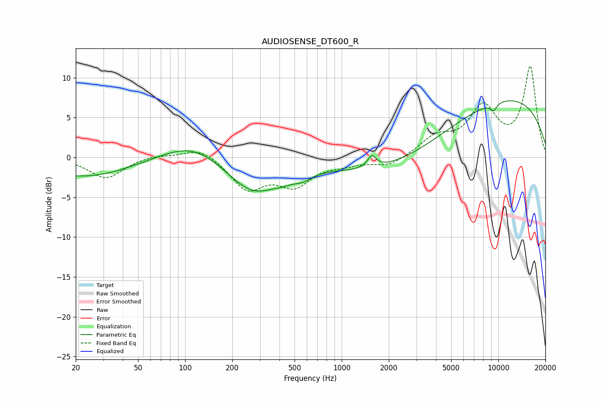

# AUDIOSENSE_DT600_R
See [usage instructions](https://github.com/jaakkopasanen/AutoEq#usage) for more options and info.

### Parametric EQs
Apply preamp of -7.2 dB when using parametric equalizer.

|   # | Type    |   Fc (Hz) |    Q |   Gain (dB) |
|-----|---------|-----------|------|-------------|
|   1 | Peaking |        23 | 0.48 |        -2.5 |
|   2 | Peaking |        25 | 5.56 |         0   |
|   3 | Peaking |       112 | 0.73 |         2.4 |
|   4 | Peaking |       271 | 0.83 |        -4.5 |
|   5 | Peaking |       424 | 2.52 |        -0.4 |
|   6 | Peaking |       562 | 2.41 |        -0.9 |
|   7 | Peaking |      1559 | 5.27 |         1.5 |
|   8 | Peaking |      2608 | 0.36 |        -3.3 |
|   9 | Peaking |      9319 | 5.91 |        -0.9 |
|  10 | Peaking |     10000 | 0.25 |         7.9 |

### Fixed Band EQs
When using fixed band (also called graphic) equalizer, apply preamp of **-11.5 dB** (if available) and set gains manually with these parameters.

|   # | Type    |   Fc (Hz) |    Q |   Gain (dB) |
|-----|---------|-----------|------|-------------|
|   1 | Peaking |        31 | 1.41 |        -2.6 |
|   2 | Peaking |        62 | 1.41 |         0.4 |
|   3 | Peaking |       125 | 1.41 |         1.4 |
|   4 | Peaking |       250 | 1.41 |        -3.8 |
|   5 | Peaking |       500 | 1.41 |        -3.2 |
|   6 | Peaking |      1000 | 1.41 |        -0.6 |
|   7 | Peaking |      2000 | 1.41 |        -1.1 |
|   8 | Peaking |      4000 | 1.41 |         2.3 |
|   9 | Peaking |      8000 | 1.41 |         5.9 |
|  10 | Peaking |     16000 | 1.41 |        11.2 |

### Graphs

