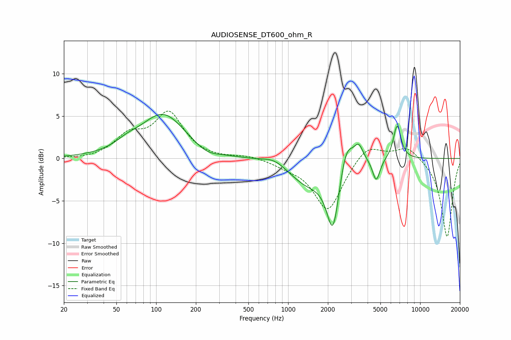

# AUDIOSENSE_DT600_ohm_R
See [usage instructions](https://github.com/jaakkopasanen/AutoEq#usage) for more options and info.

### Parametric EQs
Apply preamp of -5.3 dB when using parametric equalizer.

|   # | Type    |   Fc (Hz) |    Q |   Gain (dB) |
|-----|---------|-----------|------|-------------|
|   1 | Peaking |        60 | 1.72 |         0.7 |
|   2 | Peaking |       113 | 0.83 |         5.2 |
|   3 | Peaking |       239 | 1.51 |        -0.9 |
|   4 | Peaking |       793 | 1.54 |         0.9 |
|   5 | Peaking |      1404 | 0.92 |        -2.9 |
|   6 | Peaking |      2188 | 2.94 |        -7.7 |
|   7 | Peaking |      2752 | 2.73 |         3.7 |
|   8 | Peaking |      3424 | 4.13 |         1.9 |
|   9 | Peaking |      4649 | 5.05 |        -2.7 |
|  10 | Peaking |      6694 | 4.7  |         4.1 |

### Fixed Band EQs
When using fixed band (also called graphic) equalizer, apply preamp of **-5.7 dB** (if available) and set gains manually with these parameters.

|   # | Type    |   Fc (Hz) |    Q |   Gain (dB) |
|-----|---------|-----------|------|-------------|
|   1 | Peaking |        31 | 1.41 |        -0.1 |
|   2 | Peaking |        62 | 1.41 |         2.4 |
|   3 | Peaking |       125 | 1.41 |         5.2 |
|   4 | Peaking |       250 | 1.41 |        -0.1 |
|   5 | Peaking |       500 | 1.41 |         0.3 |
|   6 | Peaking |      1000 | 1.41 |        -0.6 |
|   7 | Peaking |      2000 | 1.41 |        -6.2 |
|   8 | Peaking |      4000 | 1.41 |         1.9 |
|   9 | Peaking |      8000 | 1.41 |         1.6 |
|  10 | Peaking |     16000 | 1.41 |        -9.3 |

### Graphs

